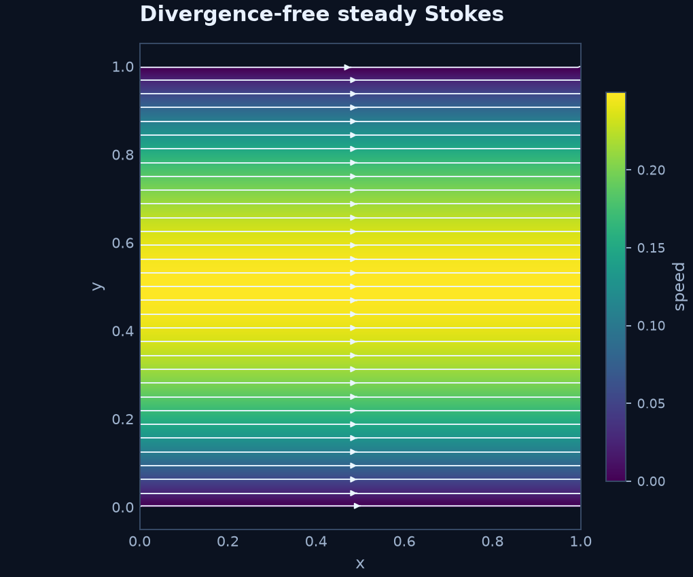
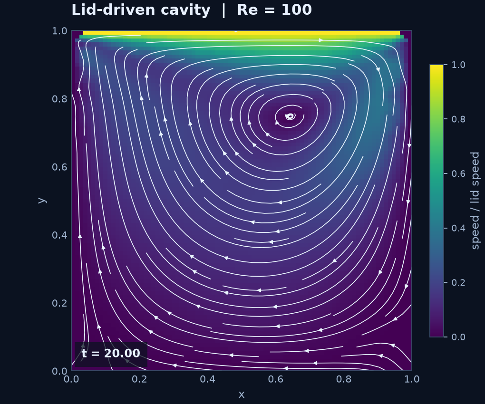

# RBFLAB

RBFLAB solves interpolation and linear PDE problems on point clouds with radial
basis functions. Write an equation with SymPy, choose global collocation,
local Hermite interpolation (LHI), or RBF-FD, then inspect the result.

The default installation uses Python, NumPy, and SciPy. C++ and PyTorch are
optional numerical backends for supported local methods. The package supports
2D and 3D scalar methods and divergence-free approximation spaces.


*The heat pulse comes from a symbolic PDE solved with global RBF collocation;
the faint dots in the first panel are the collocation nodes. The display grid
only samples the computed solution.*

## Install

Install the Python core from PyPI:

```sh
python -m pip install rbflab
```

The default installation does not require Gmsh, a compiler, or PyTorch. See
[the installation guide](docs/INSTALL.md) for optional features. From a source
checkout, use `python -m pip install .` instead.

## A symbolic PDE in a few lines

```python
import sympy as sp
import rbflab as rbf

model = rbf.SymbolicScalar(2)
u = model.field
x, y = model.coordinates
exact = sp.sin(sp.pi*x) * sp.sin(sp.pi*y)
lhs = -model.laplacian(u)
problem = model.stationary(
    sp.Eq(lhs, lhs.subs(u, exact).doit()),
    boundary=[model.bc("boundary", sp.Eq(u, 0))],
)
cloud = rbf.unit_box_grid(5)
solution = problem.solve(cloud, rbf.GlobalCollocation(rbf.IMQ(2), scheme="asymmetric"))
print(solution.evaluate([[0.3, 0.4]]))
```

Change the last method to `rbf.LHI(rbf.PHS(5), 20, polynomial_degree=2)`
or `rbf.RBFFD(rbf.PHS(5), 20, polynomial_degree=2)` to compare methods on
the same equation and cloud. The complete example reports errors against the
known solution.

## Six starting examples

| Example | What it shows |
|---|---|
| [Symbolic Poisson](examples/symbolic_poisson.py) | One equation with global, LHI, and RBF-FD |
| [Mixed boundary](examples/symbolic_boundary.py) | Variable diffusion and a Robin condition |
| [Heat](examples/symbolic_heat.py) | Symbolic time evolution |
| [Stokes spaces](examples/stokes_spaces.py) | Divergence-free velocity and pressure gradient |
| [3D operators](examples/operators_3d.py) | Sparse matrices, local reconstruction, backend choice |
| [Custom kernel](examples/custom_kernel.py) | Symbolic kernel definition and optional C++ cache |

Run, for example, `python examples/symbolic_poisson.py --method lhi` after
installing the package. The [capability table](docs/CAPABILITIES.md) identifies
which methods and backends are supported. These small examples use deterministic
points and do not require mesh generation.

## Plot a result

Install the optional plotting tools with `python -m pip install "rbflab[examples]"`.
The plotting code is separate from the numerical solver:

```python
from rbflab import viz

fig, ax = viz.plot_scalar(solution, title="My solution")
fig.savefig("solution.png", dpi=160)
# For a time-dependent result: viz.animate_scalar(trajectory, "heat.gif")
```


The [gallery generator](examples/make_gallery.py) rebuilds this animation and
the figures with `python -m examples.make_gallery`. It also plots the solved
divergence-free Stokes velocity field:



See the short [plotting guide](docs/VISUALIZATION.md) for the plotting calls and
their 2D scope.

## A moving fluid: Navier–Stokes cavity

From a source checkout, the [cavity example](examples/navier_stokes_cavity.py)
solves a Re=100 lid-driven flow with staggered RBF-FD and makes an animation
in one command:

```sh
python -m examples.navier_stokes_cavity
```




It uses a unit square built directly from NumPy, PHS7 kernels with degree-three
polynomials, and a coupled velocity–pressure time step. The
[cavity guide](docs/guides/LID_DRIVEN_CAVITY.md) reports the refinement comparison and the
remaining divergence defect. The animation interpolates nodal values solely
for display. The final frame is also saved as a PNG.

The core library lives in `python/rbflab/`; runnable examples are in
`examples/`, and focused contributor tests are in `tests/`.

## Numerical scope

The Stokes example uses a divergence-free velocity kernel: incompressibility
is built into the approximation space. LHI reconstructs pressure gradients
locally; it does not automatically produce a globally normalized pressure.
Off-node LHI evaluation currently uses the nearest stencil and can have a
different error from nodal values. Report solution error, algebraic residual,
and PDE residual separately.

The cavity showcase is not validation of a general Navier–Stokes solver.

See the [documentation site](https://ldbreton.github.io/RBFLAB/),
[getting-started guide](docs/getting-started.md), [API reference](docs/api/discretizations.md),
[installation](docs/INSTALL.md), [capabilities](docs/CAPABILITIES.md),
the [MIT license](LICENSE), and the [release checklist](RELEASE_CHECKLIST.md).
