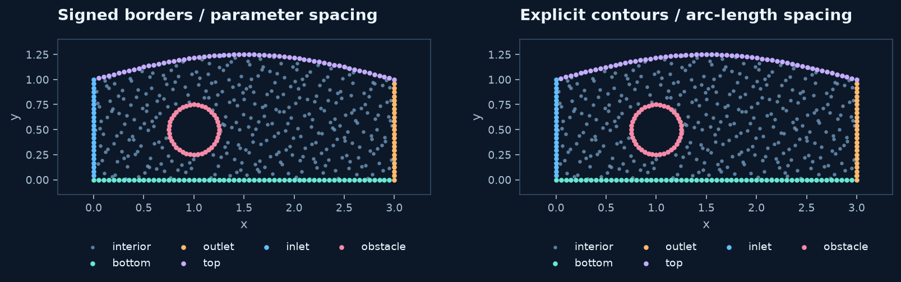

# 2D construction with parametric contours

`ParametricBoundary` describes an individual curve piece. `ParametricDomain`
connects those pieces into **one outer contour and optional hole contours**.
Unlike oriented-border construction, the role of a contour is explicit: its
position in `outer` or `holes` determines whether it encloses material or a void.

This API is useful when you want approximately uniform **arc-length** sampling,
a boundary-resolution choice separate from the dense geometric representation,
and automatic outward normals.

## Define one symbolic curve

```python
import sympy as sp
from rbflab import geometry as g, meshgen, viz

t = sp.symbols("t", real=True)
wall = g.ParametricBoundary(
    curve=(2*sp.cos(t), sp.sin(t)),
    parameter=t,
    label="wall",
    interval=(0, 2*sp.pi),
)
domain = g.ParametricDomain(wall)
cloud = meshgen.generate(domain, interior=200, boundary=96, seed=42)
fig, ax = viz.plot_cloud(cloud, normals=True)
```


The first panel uses symbolic coordinates. RBFLAB differentiates the expressions
once when constructing the curve and evaluates the resulting tangent when sampling.
You do not have to write a tangent or normal formula for this example.

The parameter can be inferred when there is exactly one free symbol. For a formula
containing `a*cos(t)`, first substitute a value for `a`; only the curve parameter
may remain free. This prevents a missing geometric dimension from becoming a
silently unresolved symbolic parameter.

## Understand every constructor argument

| Argument | Meaning |
|---|---|
| `curve` | Two SymPy expressions, or a callable accepting scalar `t` and returning `(x,y)` |
| `tangent=None` | Optional derivative `(dx/dt,dy/dt)`; otherwise derived symbolically or numerically |
| `label="boundary"` | Name for this arc; distinct arcs in one `ParametricDomain` need distinct labels |
| `interval=(0,2*pi)` | Increasing parameter endpoints; physical dimensions belong in the curve formula |
| `parameter=None` | Optional explicit SymPy parameter symbol |
| `normal=None` | Explicit outward vector `n(t)`; overrides automatic normals and is normalized |
| `difference_step=None` | Optional finite-difference step, in parameter units, for ordinary callables |

`boundary.evaluate(t)` evaluates either curve representation.
`boundary.derivative_source` reports `symbolic`, `explicit`, or `finite_difference`.
See [normals and derivative choices](labels-normals.md) for precision and orientation.

## Assemble a multi-piece exterior

The channel below has four separate exterior pieces. Write them in connected
order, with matching endpoints. A closed circle is passed separately as a hole.

```python
bottom = g.ParametricBoundary((3*t, 0), label="bottom", interval=(0,1))
outlet = g.ParametricBoundary((3, t), label="outlet", interval=(0,1))
top = g.ParametricBoundary((3*(1-t), 1+sp.sin(sp.pi*t)/4),
                           label="top", interval=(0,1))
inlet = g.ParametricBoundary((0, 1-t), label="inlet", interval=(0,1))
obstacle = g.ParametricBoundary(
    (1+sp.cos(t)/4, sp.Rational(1,2)+sp.sin(t)/4), label="obstacle",
)
domain = g.ParametricDomain([bottom, outlet, top, inlet], holes=[obstacle])
cloud = meshgen.generate(domain, interior=350, boundary={
    "bottom":60, "outlet":24, "top":60, "inlet":24, "obstacle":40,
}, seed=42)
```



The right panel uses this construction. Compare it with the left panel's
[oriented-border recipe](parametric-borders.md): both describe the same material,
but parameter-uniform and arc-length sampling can place boundary nodes differently.
Their polygonal membership approximations also use different resolutions.

## How to label only part of a curved boundary

A label belongs to an **arc**, not to the entire geometric shape. Split the
parameter interval wherever the intended boundary condition changes. For an
ellipse, four arcs starting at successive quarter turns can be constructed as:

```python
arcs = [
    g.ParametricBoundary((1.5*sp.cos(t), .9*sp.sin(t)),
        label=f"arc_{j}", interval=(j*sp.pi/2, (j+1)*sp.pi/2))
    for j in range(4)
]
hole = g.ParametricBoundary((.3*sp.cos(t), .3*sp.sin(t)), label="hole")
domain = g.ParametricDomain(arcs, holes=[hole])
cloud = meshgen.generate(domain, interior=220, boundary={
    "arc_0":30, "arc_1":30, "arc_2":30, "arc_3":30, "hole":36,
})
```


You can replace quarter turns by any increasing partition of the parameter
interval. If several arcs need the same boundary equation, keep distinct names
here and assign that equation to each label. `Border` also supports shared labels;
`ParametricDomain` currently requires unique arc names for count allocation.

## Multiple holes and contour orientation

`holes` is a sequence of contours. Each item may be a single closed curve or a
sequence of connected arcs, just like `outer`. Both clockwise and counterclockwise
contours are accepted. Tangent-derived normals are corrected to point out of the
material, including into holes. Explicit `normal=` overrides must already have
the intended outward direction and are not flipped.

Contours must be closed and simple. Holes must lie inside the exterior without
intersecting. At an arc junction, the terminating arc excludes the endpoint and
the starting arc owns it. Split nonsmooth curves at corners; there is no unique
smooth normal at a corner.

## Geometry approximation versus node count

Generic membership uses a polygon with 2048 straight segments **per arc**, while
boundary nodes are sampled on the actual curve. The same dense table estimates
arc length. An integer boundary total is distributed approximately in proportion
to arc length, with at least three points per arc; a dictionary gives exact
per-arc counts.

This is not exact CAD geometry. Very thin features or extremely small requested
errors may require a finer geometric model than this fixed approximation.
Increasing `boundary=...` changes node count, not the table resolution. Built-in
`Disk`, `Ellipse`, `Annulus`, and `Flower` use analytic membership instead.
