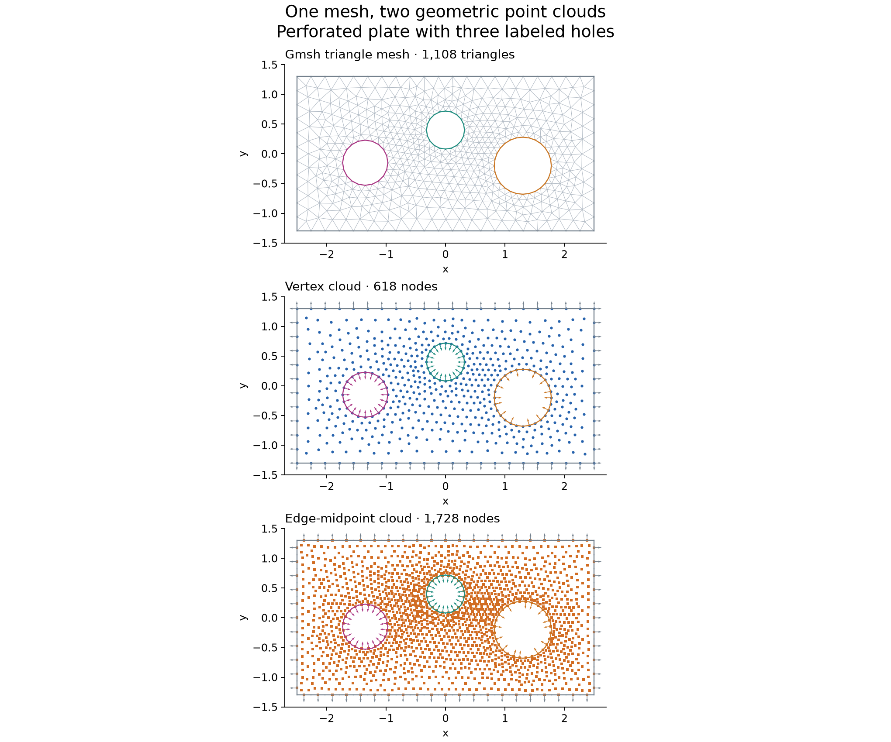

# Import a connected 2D mesh from Gmsh

Use Gmsh when you need explicit triangle connectivity, its geometry tools, or
its mesh-size controls. Built-in RBFLAB curve generation does not require Gmsh.

```sh
python -m pip install "rbflab[mesh,examples]"
```

## A plate with three circular holes

The complete construction is in `examples/perforated_plate.py`. It defines four
straight sides, circular arcs for each hole, one plane surface, and physical curve
groups that name the boundaries.

```python
from examples.perforated_plate import build_perforated_plate, plot_layout
from rbflab.geometry import staggered_clouds

mesh, original_node_tags = build_perforated_plate(mesh_size=.24)
layout = staggered_clouds(mesh)
plot_layout(mesh, layout, "perforated_plate.png")
```



Run from a source checkout, keeping the `examples` directory available. This is
a geometry demonstration and does not solve a flow problem. The returned node-tag
array maps RBFLAB's zero-based coordinate rows back to Gmsh's original tags.

## Import your own model

Create your geometry and first-order triangles with Gmsh, then call
`meshgen.from_gmsh()` while that model is active. The essentials of boundary naming are:

```python
# In your initialized Gmsh model, after creating and synchronizing curves:
# group = gmsh.model.addPhysicalGroup(1, curve_tags)
# gmsh.model.setPhysicalName(1, group, "wall")
# gmsh.model.mesh.generate(2)
# mesh, original_node_tags = meshgen.from_gmsh()
```

A physical curve group can contain several curve tags; they become one boundary
label. Every exterior edge must be covered when using explicit labels. The adapter
reads an existing model: it does not initialize, clear, remesh or finalize it.

The current adapter expects first-order, three-node triangles in an XY-parallel
plane and first-order boundary lines. Construction-only points are discarded.
It reads exterior physical curves; for explicit internal-interface edge labels,
construct `TriangleMesh2D` with the desired `interface_edges` mapping.

## Choose what to keep

- Keep `TriangleMesh2D` for topology-aware work.
- Use `staggered_clouds(mesh).vertices` for its vertex PointCloud.
- Use `staggered_clouds(mesh).edge_midpoints` when a staggered algorithm needs that
  separate set of locations. See [what staggering means](staggered.md).

The example owns and closes its Gmsh session, and refuses to replace an existing
active session. Existing square/cube helpers remain available for simple tests;
this chapter focuses on reusable labeled geometry.
