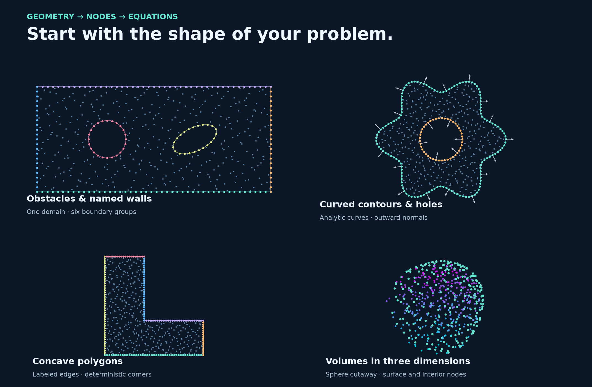

# Mesh generation

A numerical method needs more than coordinates: it needs to know **where the
material lies**, **which points belong to each boundary**, and often **which
way the boundary normal points**. This chapter builds those ingredients from
simple shapes, labeled curves, and existing meshes.



## The construction philosophy

Describe the geometry first; choose its sampling resolution afterwards. A
boundary is assembled from named pieces, so that changing the number of nodes
does not change the meaning of a label such as `inlet` or `heated_wall`.
This separation of curves, labels, orientation and discretization follows the
approach illustrated in [FreeFEM's mesh-generation manual](https://doc.freefem.org/documentation/mesh-generation.html).

RBFLAB usually needs **point clouds**, rather than finite-element cells:

1. **Define the material.** A filled shape, an outer contour with holes, or a 3D region.
2. **Label its parts.** Names identify boundary groups; they do not impose equations.
3. **Choose resolution.** Set interior and boundary node counts independently.
4. **Generate and inspect.** Plot the points, labels and normals; inspect spacing.
5. **Use the cloud.** Pass the same `PointCloud` to a numerical method, or access its arrays.

Ordinary generation does not invent triangle or tetrahedron connectivity.
When an algorithm needs connected elements, use an explicit mesh or import one
from Gmsh. A plotted collection of nodes is not a triangulation.

## One generation function

The geometry API is included in the base installation. To run the plotting
lines used throughout this chapter, install the optional example dependencies:

```sh
python -m pip install --upgrade "rbflab[examples]"
```


```python
from rbflab import geometry, meshgen, viz

domain = geometry.Annulus(inner_radius=.35, outer_radius=1.)
cloud = meshgen.generate(domain, interior=200,
                         boundary={"inner": 40, "outer": 80}, seed=42)
fig, ax = viz.plot_cloud(cloud, normals=True)
```


The center is a hole: it gets boundary samples but no material samples.
Normals on the inner circle point into the hole.

`meshgen.generate` accepts the following descriptions:

| Input | How resolution is selected | Best starting point |
|---|---|---|
| `Disk`, `Ellipse`, `Rectangle`, `Polygon`, `Annulus`, `Flower` | `interior=...`, `boundary=...` | [Built-in 2D domains](planar-domains.md) |
| A list of `Border` objects | `wall(n)` per piece, then `interior=...` | [Oriented borders](parametric-borders.md) |
| `ParametricDomain` | `boundary` total or counts per arc label | [Parametric contours](custom-domains.md) |
| `Sphere`, `Box`, `Cylinder`, `ImplicitRegion` | Interior and total surface counts | [3D volumes](volumes-3d.md) |
| `ParametricSurface3D` | `interior=0`, `boundary=...` | [3D surfaces](surfaces-3d.md) |

Automatic curve differentiation and direct generation from borders/surfaces
require **RBFLAB 0.4 or newer**. Existing array-based workflows remain available.

## Learn to build beyond the examples

Follow these sections in order:

- [Built-in 2D domains](planar-domains.md): dimensions, rotations, polygons and holes.
- [Oriented borders](parametric-borders.md): assemble a channel from individually labeled curves.
- [Parametric contours](custom-domains.md): specify outer and hole contours explicitly, with arc-length sampling.
- [Labels and normals](labels-normals.md): split boundaries, choose derivative sources and inspect outward orientation.
- [Sampling and quality](sampling.md): counts, reproducibility, spacing and geometry resolution.

Then choose a separate branch for [3D volumes](volumes-3d.md), [3D surfaces](surfaces-3d.md),
[Gmsh meshes](gmsh.md), or [staggered clouds](staggered.md).
Every construction section includes a picture of its generated nodes. A PDE is
not required to construct or inspect a geometry.

## What the result contains

| Attribute | Meaning |
|---|---|
| `cloud.points` | Unique Float64 coordinates, shape `(N, 2)` or `(N, 3)` |
| `cloud.boundary` | Boundary label → coordinate-row indices |
| `cloud.normals` | Boundary label → outward unit vectors, aligned with those indices |
| `cloud.interior` | Coordinates not assigned to an exterior boundary |
| `cloud.interfaces` | Named internal-interface samples; these remain interior unknowns |
| `cloud.regions` | Named/indexed groups of material samples |
| `cloud.triangles` | Explicit optional connectivity, empty for ordinary generated clouds |

Labels are metadata. A label called `inlet` does not impose inflow; `model.bc("inlet", ...)`
assigns its equation later. Interface labels likewise do not create transmission
conditions automatically. Selecting MPFR for numerical weights does not increase
the Float64 precision of input coordinates.

## Supply your own coordinates

No generator is mandatory. Construct `PointCloud(points, boundary=groups, normals=vectors)`
from your own arrays. Coordinates must be finite and unique; group arrays index
those coordinate rows. Normals can be omitted for Dirichlet-only problems and
must be provided for flux conditions. The [API reference](../api/mesh-generation.md)
describes the array shapes. Optional connectivity remains separate from coordinates.
