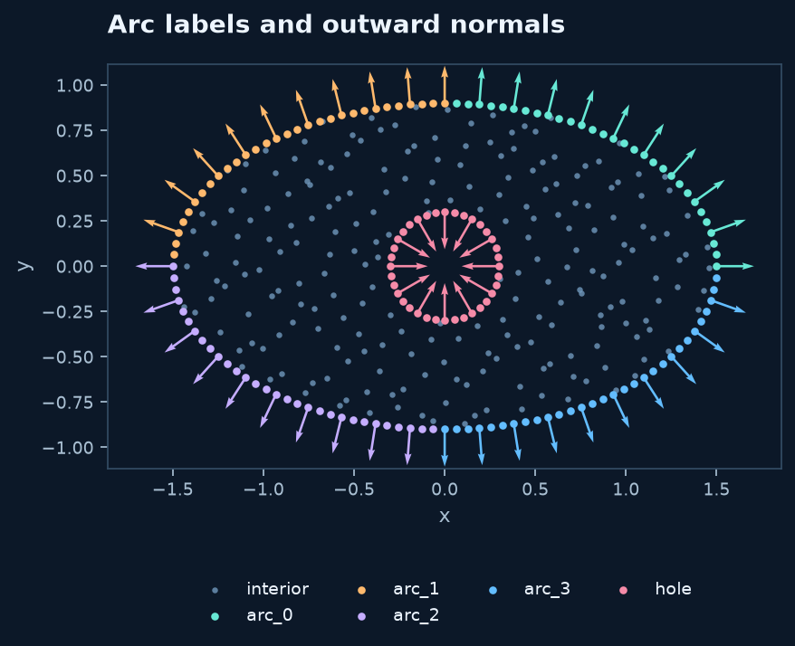
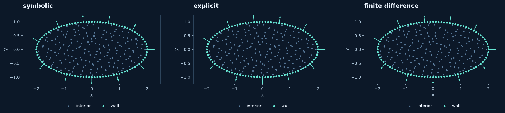
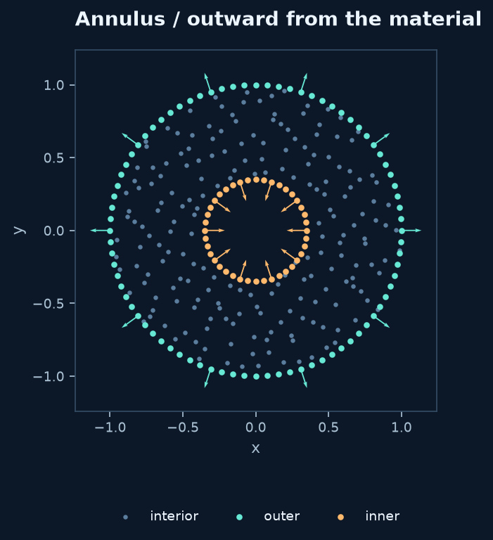

# Boundary labels and normals in 2D

A label is a name for a group of boundary nodes. A normal is a direction attached
to each of those nodes. The label answers **which equation belongs here?** The
normal answers **which direction points out of the material?**

## Split the geometry where the label changes

```python
from rbflab import geometry as g, meshgen, viz

domain = g.with_holes(
    g.Ellipse(1.5, .9, labels=("arc_0","arc_1","arc_2","arc_3")),
    {"hole": g.Disk(.3)},
)
cloud = meshgen.generate(domain, interior=220, boundary={
    "arc_0":30, "arc_1":30, "arc_2":30, "arc_3":30, "hole":36,
})
fig, ax = viz.plot_cloud(cloud, normals=True)
```



Here `arc_0` starts at the ellipse's rightmost point and covers the first parameter
quarter-turn. The other arcs continue counterclockwise. The keys of
`cloud.boundary` are those exact names; `cloud.normals[label]` has one vector per
index in `cloud.boundary[label]`, in the same order.

```python
indices = cloud.boundary["hole"]
coordinates = cloud.points[indices]
normal_vectors = cloud.normals["hole"]
```

Names such as `inlet`, `wall` and `flux` have no built-in physical effect. Later,
a symbolic boundary condition references the name with `model.bc("wall", ...)`.
Internal interfaces are separate: they remain interior unknowns and need explicitly
chosen transmission conditions. Their normal depends on which material side you mean.

## Normals come from tangents

For a regular planar curve $\gamma(t)=(x(t),y(t))$, a right-hand unit normal is

$$n_R(t)=\frac{(y'(t),-x'(t))}{\sqrt{x'(t)^2+y'(t)^2}}.$$

The surrounding domain chooses whether $n_R$ or $-n_R$ is outward. Therefore the
same circle has opposite outward normals when used as an exterior and as a hole.
This cannot be determined from a curve formula alone.

## Three derivative choices, one curve interface

These define the same ellipse:

```python
import numpy as np
import sympy as sp

t = sp.symbols("t", real=True)
symbolic = g.ParametricBoundary((2*sp.cos(t), sp.sin(t)), label="wall")
explicit = g.ParametricBoundary(
    lambda t: (2*np.cos(t), np.sin(t)),
    tangent=lambda t: (-2*np.sin(t), np.cos(t)), label="wall",
)
numerical = g.ParametricBoundary(
    lambda t: (2*np.cos(t), np.sin(t)), label="wall",
)
cloud = meshgen.generate(g.ParametricDomain(symbolic), interior=200, boundary=96, seed=42)
```



| Choice | How the derivative is obtained | When to choose it |
|---|---|---|
| Symbolic coordinates | SymPy differentiates expressions once at construction | An analytic formula is available |
| Callable + `tangent` | Your derivative is evaluated directly | A callable has an accurate known derivative |
| Callable alone | Second-order finite differences | Prototyping or a smooth callable without symbolic form |

The same `tangent`, `normal`, `parameter` and `difference_step` options apply to
`Border`. No PyTorch dependency is needed for these geometry derivatives.
`derivative_source` lets you inspect which route was selected.

### Numerical fallback: what it does and does not guarantee

The default step is the parameter-interval length times machine epsilon to the
power $1/3$. Interior evaluations use centered differences; near endpoints the
method uses second-order forward/backward differences and stays inside the interval.
`difference_step=...` overrides the step in **parameter units**, not physical length.
It must be positive and no larger than one quarter of the interval.

Differencing introduces truncation and roundoff error. A badly scaled parameter,
noisy callable, or nonsmooth curve can yield inaccurate normals. Split at corners
and avoid stationary parameterizations where the tangent vanishes. Prefer symbolic
or supplied derivatives for sensitive flux conditions. A finite vector is not an
accuracy certificate.

## Explicit normal overrides

A curve-level override accepts a function of its **parameter**:

```python
wall = g.ParametricBoundary(
    (sp.cos(t), sp.sin(t)), label="wall",
    normal=(sp.cos(t), sp.sin(t)),
)
```

A cloud-level override accepts a function of that label's **coordinates**:

```python
cloud = meshgen.generate(g.Annulus(.35, 1.), interior=200,
    boundary={"inner":40, "outer":80}, seed=42,
    normals={"inner": lambda points: -points/np.linalg.norm(points,axis=1)[:,None]},
)
```



Arrays of matching `(N_label, dimension)` shape can replace the cloud callback.
Finite nonzero vectors are normalized. **Explicit directions are authoritative:**
they are not silently flipped, even if they point inward. Curve overrides take
precedence over derived normals; `generate(normals=...)` takes precedence over both.
Use this for specialized geometry conventions, with responsibility for orientation.

## Corners and labels

For generated 2D arcs, a corner belongs to the piece starting there, and its normal
comes from that piece. The other incident edge generally has another normal.
Do not assume an averaged normal or two boundary equations at that point.
With a connected mesh, corner membership may include several labels; the
[staggered-cloud section](staggered.md) explains its per-label normal convention.
