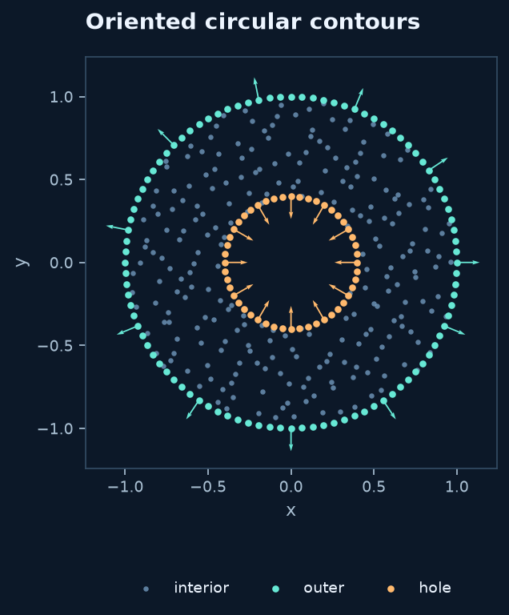
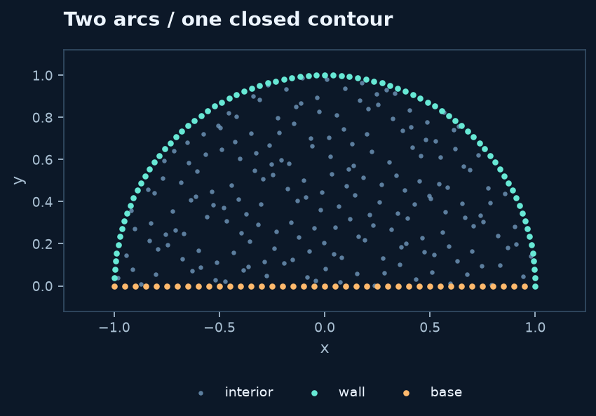

# 2D construction with oriented borders

A `Border` describes one parametric boundary piece. Its formula, parameter
interval and label describe the geometry; calling `piece(n)` chooses how many
segments sample it. Assemble pieces into closed contours, then pass them directly
to `meshgen.generate`. No adapter or separate generator package is needed.

## A circular exterior and an inner hole

```python
import sympy as sp
from rbflab import geometry as g, meshgen, viz

t = sp.symbols("t", real=True)
outer = g.Border((sp.cos(t), sp.sin(t)), label="outer", t_start=0, t_end=2*sp.pi)
hole = g.Border((sp.Rational(2,5)*sp.cos(t), sp.Rational(2,5)*sp.sin(t)), label="hole", t_start=0, t_end=2*sp.pi)
cloud = meshgen.generate([outer(96), hole(-48)], interior=240, seed=42)
fig, ax = viz.plot_cloud(cloud, normals=True)
```



Symbolic coordinates derive their tangents and
normals automatically. Here `t` is inferred as the only free symbol; `parameter=t`
can make that choice explicit. Substitute any additional symbolic parameters first.

## Traversal, material and holes

For `RBFMesh`/border construction, a counterclockwise closed contour adds material;
a clockwise contour removes it. For the circles above, positive counts traverse
counterclockwise and `hole(-48)` reverses the inner circle.

The sign means **reverse the supplied curve**, not simply “make a hole.” If your
formula already runs clockwise, a positive count keeps it clockwise. Reversing
a contour built from several pieces means reversing every piece consistently.
Open contours and inconsistent endpoint connections raise an error.

`abs(n)` is the number of parameter subintervals. Each arc retains its first
endpoint and omits its last, so a junction belongs to the next arc. `Border(n)`
updates that object; construct distinct `Border` objects for distinct pieces.

## Connect a line to a curved wall

```python
wall = g.Border((sp.cos(t), sp.sin(t)), "wall", 0, sp.pi)
base = g.Border((-1+2*t, 0), "base", 0, 1)
cloud = meshgen.generate([wall(80), base(40)], interior=200)
```



Follow the contour: `wall` starts at `(1,0)` and ends at `(-1,0)`; `base` starts
there and returns to `(1,0)`. The resulting material lies on the left of traversal.
The two labels let you later prescribe different equations on the base and wall.

## Build a channel from independently labeled pieces

Think in endpoints first. For this example, use four pieces around the exterior:

| Piece | Start | End | Formula for $0\le t\le1$ |
|---|---|---|---|
| bottom | `(0,0)` | `(3,0)` | $(3t,0)$ |
| outlet | `(3,0)` | `(3,1)` | $(3,t)$ |
| top | `(3,1)` | `(0,1)` | $(3(1-t),1+\sin(\pi t)/4)$ |
| inlet | `(0,1)` | `(0,0)` | $(0,1-t)$ |

```python
bottom = g.Border((3*t, 0), "bottom", 0, 1)
outlet = g.Border((3, t), "outlet", 0, 1)
top = g.Border((3*(1-t), 1+sp.sin(sp.pi*t)/4), "top", 0, 1)
inlet = g.Border((0, 1-t), "inlet", 0, 1)
obstacle = g.Border((1+sp.cos(t)/4, sp.Rational(1,2)+sp.sin(t)/4),
                    "obstacle", 0, 2*sp.pi)
cloud = meshgen.generate(
    [bottom(60), outlet(24), top(60), inlet(24), obstacle(-40)],
    interior=350, seed=42,
)
```


The left panel uses this border recipe. Increase a piece's count to resolve its
curvature or a nearby narrow gap. Keep `boundary` omitted from `generate`: the
counts are already encoded in each `Border(n)`. The interior count is independent.

You can give different arcs the same label, for example `wall` on both the top
and bottom. The returned `cloud.boundary["wall"]` then groups their nodes. Split
labels wherever boundary equations or corner-normal ownership need to differ.

## Ordinary callables and supplied derivatives

NumPy callables use the same interface:

```python
import numpy as np
wall = g.Border(lambda t: (2*np.cos(t), np.sin(t)), "wall", 0, 2*np.pi,
                tangent=lambda t: (-2*np.sin(t), np.cos(t)))
```

`tangent` is optional. Without it, a callable uses a second-order numerical
approximation, with one-sided differences at interval endpoints. Read
[labels and normals](labels-normals.md) before relying on numerical normals for
flux conditions. Explicit `normal=lambda t: (...)` is also supported; its
orientation is retained and its length normalized.

## Regions, interfaces and existing constructions

The border engine can partition overlapping positive contours and retain internal
interfaces. In the unified cloud, samples on the **union's exterior** become
boundary groups; retained internal contours become `cloud.interfaces` groups.
Internal interfaces remain interior unknowns and get no automatic normal or PDE.
Use separate labels for exterior and internal pieces: reusing one name across
both roles is rejected. `is_border=False` keeps a contour in the geometry but
omits its samples from these labeled groups.

An existing `meshgen.RBFMesh(...)` construction is also accepted by
`meshgen.generate(mesh, interior=...)`. Generation resamples according to the
requested options without changing `mesh.Points`. For already sampled arrays,
construct a `PointCloud` with explicit boundary labels and normals.

**Geometry accuracy:** the segment samples define a polygonal approximation.
Nodes are uniform in the parameter, not generally in physical arc length.
Increasing the interior count does not refine boundary geometry. For a separate
geometric representation and approximately uniform arc-length sampling, use
[ParametricBoundary and ParametricDomain](custom-domains.md).
