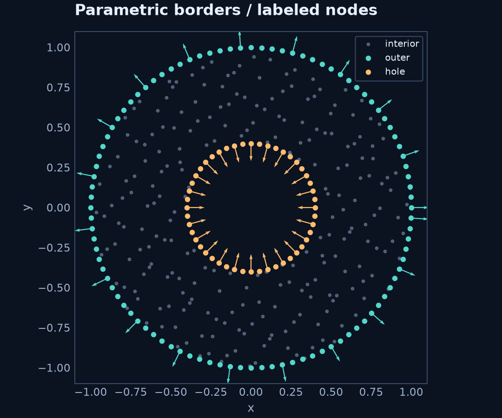

# Parametric borders: the FreeFEM-inspired style

**Your original `Border` syntax is part of RBFLAB.** Define a labeled curve,
choose its parameter interval, then attach a signed segment count when building
the domain. These interfaces have been included since RBFLAB 0.2; no separate
RBFMeshGen installation is needed.

The idea follows [FreeFEM's border-based mesh construction](https://doc.freefem.org/documentation/mesh-generation.html):
parametric pieces, boundary labels and signed traversal counts. Here `RBFMesh`
generates a point cloud. It does not call FreeFEM or construct a finite-element
triangulation, and border composition uses comma-separated arguments rather than `+`.

## A domain with a hole

```python
import numpy as np
import rbflab as rbf
from rbflab.geometry import Border
from rbflab.meshgen import RBFMesh

outer = Border(lambda t: (np.cos(t), np.sin(t)),
               label="outer", t_start=0, t_end=2*np.pi)
hole = Border(lambda t: (.4*np.cos(t), .4*np.sin(t)),
              label="hole", t_start=0, t_end=2*np.pi)
mesh = RBFMesh(outer(96), hole(-48))
mesh.generate_points(240, method="halton", seed=42, append=False)
cloud = rbf.from_rbfmeshgen(mesh, boundary_labels=["outer", "hole"])
```

This produces 240 interior nodes, 96 exterior nodes and 48 hole nodes. The adapter
name `from_rbfmeshgen` is retained for compatibility; it also accepts the integrated
`rbflab.meshgen.RBFMesh` object shown here. Its output is the same `PointCloud`
used by global collocation, LHI and RBF-FD.

### What does the sign mean?

`outer(96)` samples 96 parameter subintervals in the curve's given direction.
`hole(-48)` reverses the second curve. Both curves above were initially defined
counterclockwise, so reversal makes the inner contour clockwise.

`RBFMesh` interprets **counterclockwise closed contours as material** and
**clockwise closed contours as holes**. Negative counts reverse traversal; they
do not independently declare a hole if the underlying curve already runs clockwise.
Boundary labels become the names used in `model.bc(...)`.

Each arc omits its terminal endpoint. On a joined contour, the next arc owns that
corner. A call such as `outer(96)` modifies the `Border` object in place; create
separate objects for distinct arcs rather than passing the same object twice.

## Join several curves

A contour can combine straight and curved pieces. This upper half-disk has
separate labels on the curved wall and its base:

```python
wall = Border(lambda t: (np.cos(t), np.sin(t)),
              label="wall", t_start=0, t_end=np.pi)
base = Border(lambda t: (-1 + 2*t, 0),
              label="base", t_start=0, t_end=1)
half_disk = RBFMesh(wall(80), base(40))
half_disk.generate_points(200, seed=7, append=False)
half_cloud = rbf.from_rbfmeshgen(half_disk, boundary_labels=["wall", "base"])
```

Endpoints must connect within `RBFMesh`'s `abs_tol`. Open or invalid contours raise
an error. Multiple arcs may share a label, which groups them for a boundary condition.
To retain internal interfaces, explicitly list their labels in the adapter's
`interface_labels` argument; an interface is not automatically an exterior boundary.

## Supply normals for flux conditions

Dirichlet data only needs points and labels. Neumann and Robin data also needs
outward normals. `Border` takes coordinates alone, so the adapter requires you
to supply those normals instead of guessing derivatives.

For these circles, the smooth-boundary normals are known exactly:

```python
unit_radial = lambda points: points / np.linalg.norm(points, axis=1)[:, None]
cloud = rbf.from_rbfmeshgen(
    mesh, boundary_labels=["outer", "hole"],
    normals={"outer": unit_radial, "hole": lambda points: -unit_radial(points)},
)
```

Callbacks receive an `(N, 2)` array of the selected label's points and return the
corresponding normal vectors. Hole normals point **out of the material**, into
the hole. These callbacks describe the original smooth circles; they are not
normals to the straight chords used for interior membership tests.



## Use the cloud in a symbolic PDE

For a concrete check, let $u_\star=\exp(x/2)\cos(y)$ and solve

$$
(-\Delta+1)u=\tfrac74 u_\star,
\qquad u=u_\star\ \text{on the outer wall},
\qquad \partial_n u=\partial_n u_\star\ \text{on the hole}.
$$

```python
import sympy as sp

model = rbf.SymbolicScalar(2)
u = model.field
x, y = model.coordinates
exact = sp.exp(x/2)*sp.cos(y)
lhs = -model.laplacian(u) + u
dn = model.normal_derivative(u)
problem = model.stationary(
    sp.Eq(lhs, lhs.subs(u, exact).doit()),
    boundary=[
        model.bc("outer", sp.Eq(u, exact)),
        model.bc("hole", sp.Eq(dn, dn.subs(u, exact).doit())),
    ],
)
method = rbf.RBFFD(rbf.PHS(5), 35, polynomial_degree=3,
    stencil_policy=rbf.StencilPolicy(scaling="local"),
    local_backend=rbf.PythonBackend(compute_condition=False))
solution = problem.solve(cloud, method)
```

The runnable example reports maximum nodal error against the known solution.
The documented 384-node Float64 Python recipe gives approximately $6.43\times10^{-4}$;
this is one mixed-boundary example, not a convergence result.

From a source checkout:

```sh
python -m examples.parametric_borders --plot borders.png
python -m examples.parametric_borders --backend cpp
python -m examples.parametric_borders --backend torch
```

The shared example helper prepares C++/PyTorch kernels before assembly.
The global sparse solve in these examples remains SciPy Float64.

## Which curve interface should I choose?

| Interface | Input | Sampling and geometry | Normals |
|---|---|---|---|
| `Border` + `RBFMesh` | Coordinates, interval, label and signed segment count | Uniform in parameter; sampled polygon determines material and holes | Supplied explicitly when converting to `PointCloud` |
| `ParametricBoundary` + `ParametricDomain` | Coordinates and analytic tangent, with explicit outer/hole contours | Approximately uniform arc length; dense polygons for generic membership | Computed from the tangent and corrected for outward orientation |

Use the border syntax when it matches how you think about your geometry. Use
[analytic parametric boundaries](custom-domains.md) when you want tangent-based
normals and arc-length sampling. Both lead to the same solver API.

Increasing `Border(n)` refines **both** its boundary nodes and its polygonal
geometry approximation. Interior refinement alone does not improve that geometry.
Random, Halton and Sobol samplers do not guarantee a minimum inter-node distance.
