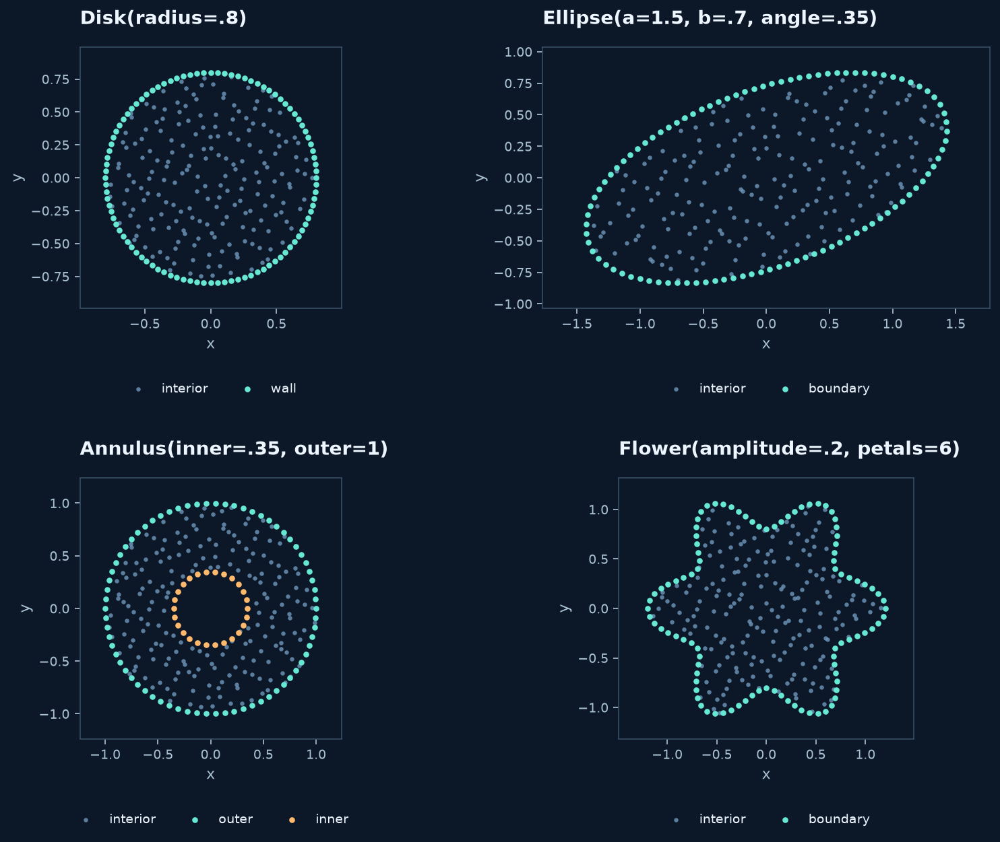
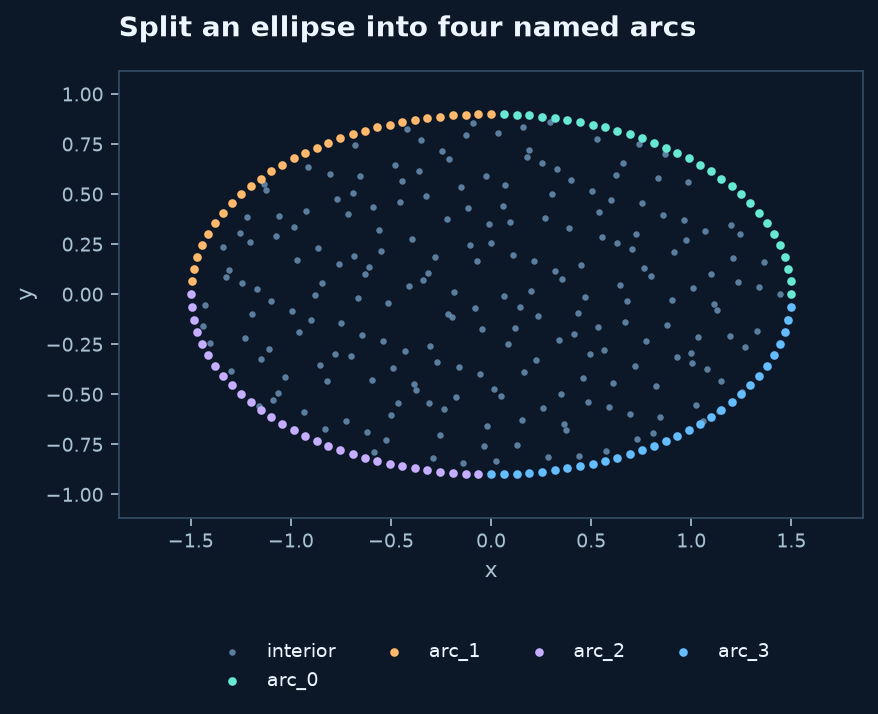
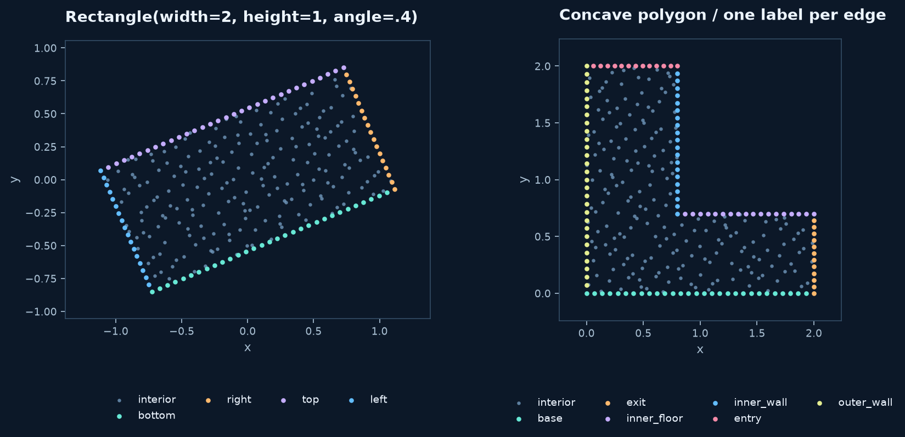
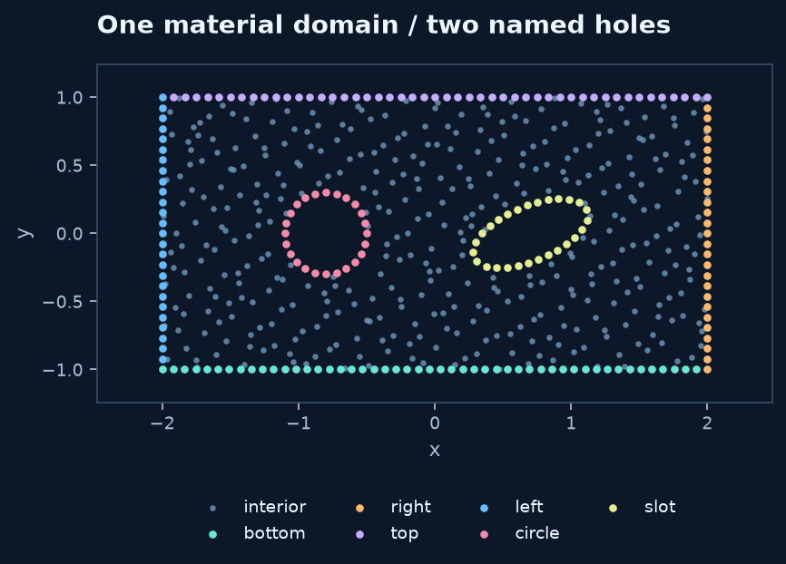

# Built-in 2D domains

Use a primitive when it describes the geometry directly. Each constructor defines
a **filled material domain** with named boundary pieces. `meshgen.generate`
then chooses node locations. All lengths use your chosen physical units; angles
are in radians.

## Disks, ellipses, annuli and flowers

```python
from rbflab import geometry as g, meshgen, viz

disk = g.Disk(radius=.8, center=(0., 0.), label="wall")
ellipse = g.Ellipse(a=1.5, b=.7, angle=.35)
annulus = g.Annulus(inner_radius=.35, outer_radius=1.)
flower = g.Flower(radius=1., amplitude=.2, petals=6)

cloud = meshgen.generate(ellipse, interior=200, boundary=96, seed=42)
fig, ax = viz.plot_cloud(cloud)
```



Each panel uses 200 interior nodes and 96 boundary nodes. Replace `ellipse` in
the generation call with any of the other domain objects to construct its panel.

| Constructor | Geometric meaning | Parameters and default labels |
|---|---|---|
| `Disk(radius=1, center=(0,0), label="boundary")` | Filled circle | Radius is positive; one perimeter label |
| `Ellipse(a=1.3, b=.8, center=(0,0), angle=0, labels=("boundary",))` | Filled rotated ellipse | `a`, `b` are **semi-axes**, not full width/height |
| `Annulus(inner_radius=.4, outer_radius=1, center=(0,0))` | Material between concentric circles | `0 < inner_radius < outer_radius`; labels `inner`, `outer` |
| `Flower(radius=1, amplitude=.18, petals=5, center=(0,0), label="boundary")` | Smooth radial boundary | Positive integer `petals`; `0 <= amplitude < 1` |

For an ellipse, local coordinates are $(a\cos t,b\sin t)$. Rotation is
counterclockwise around `center`. For a flower,

$$r(t)=\text{radius}\,[1+\text{amplitude}\cos(\text{petals}\,t)].$$

`radius` is the reference radius; the smallest and largest radii are
`radius*(1-amplitude)` and `radius*(1+amplitude)`. Large modulation creates
narrow features that need adequate node resolution.

## Divide a curved boundary into labels

An ellipse can be split into equal **parameter-angle** arcs:

```python
domain = g.Ellipse(1.5, .9, labels=("arc_0", "arc_1", "arc_2", "arc_3"))
cloud = meshgen.generate(domain, interior=220,
    boundary={"arc_0": 30, "arc_1": 30, "arc_2": 30, "arc_3": 30}, seed=42)
```

The arcs cover $[0,\pi/2)$, $[\pi/2,\pi)$, $[\pi,3\pi/2)$, and $[3\pi/2,2\pi)$.
Thus `arc_0` starts at local `(a, 0)` and ends before `(0, b)`. Labels rotate with
the ellipse. This also works for a circle by choosing `a=b`.



For unequal arc intervals or arbitrary curved pieces, use
[ParametricBoundary](custom-domains.md). A label identifies a boundary group,
not its boundary condition.

## Rectangles and arbitrary polygons

```python
rectangle = g.Rectangle(width=2., height=1., angle=.4)
elbow = g.Polygon(
    [(0,0), (2,0), (2,.7), (.8,.7), (.8,2), (0,2)],
    labels=("base", "exit", "inner_floor", "inner_wall", "entry", "outer_wall"),
)
cloud = meshgen.generate(elbow, interior=200, boundary=120, seed=0)
```



`Rectangle(width=2, height=1, center=(0,0), angle=0)` is centered at `center`.
Its default labels are `bottom`, `right`, `top`, `left` in **local coordinates**;
these names rotate with it. Supply `labels=(...)` to rename them in that order.

`Polygon(vertices, labels=None)` joins consecutive vertices and closes the last
edge to the first. Vertices can be clockwise or counterclockwise. Concave polygons
are supported; self-intersections, repeated vertices and zero-area shapes are
rejected. A repeated closing vertex is allowed. Default labels are `edge_0`,
`edge_1`, etc. Label `j` belongs to the edge starting at vertex `j`.

At a corner, the generator retains the point once, on the edge starting there.
Its normal is that edge's normal, not a corner average. Choose boundary equations
at corners deliberately; the PDE itself may have reduced regularity there.

## Cut named holes from a domain

`with_holes(outer, holes)` returns a new material domain. The dictionary keys
name the holes; its values describe the shapes to remove.

```python
plate = g.with_holes(
    g.Rectangle(4., 2.),
    {
        "circle": g.Disk(.3, center=(-.8, 0)),
        "slot": g.Ellipse(.45, .2, center=(.7, 0), angle=.4),
    },
)
cloud = meshgen.generate(plate, interior=400, boundary=200, seed=0)
```



- Exterior labels are preserved: here `bottom`, `right`, `top`, `left`.
- A single-arc hole receives its dictionary name: `circle` or `slot`.
- A multi-arc hole receives names such as `opening/edge_0` or `opening/top`.
- Holes must lie strictly inside the existing material and must not touch or overlap.
- Existing holes are preserved, and the input domains are not modified.
- Normals on a hole point into the removed region.

To choose resolution explicitly, inspect `list(plate.boundaries)` and provide
all its labels in the boundary-count dictionary. Alternatively, an integer total
is allocated approximately in proportion to arc length, with at least three nodes
per arc. This allocation preserves the requested total.

This helper is for disjoint holes, not arbitrary Boolean CAD. Curved composition
uses a polygon with 2048 segments per arc for membership/topology, while retaining
the analytic curve for boundary sampling. Refine the geometric representation
separately if studying errors near that scale.

## Extend the construction

To build a shape not available as a primitive:

1. Sketch its outer contour and each hole separately.
2. Mark points where the formula or desired boundary label changes.
3. Write each intervening piece as a curve of one parameter.
4. Use [oriented borders](parametric-borders.md) or [explicit contours](custom-domains.md).
5. Plot labels and normals before selecting a numerical method.

Constructor signatures and return types are listed in the
[geometry API reference](../api/mesh-generation.md).
