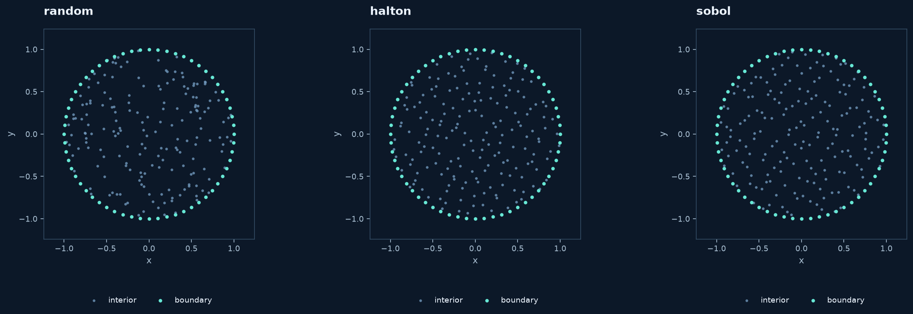

# Sampling, resolution and geometric quality

After fixing the geometry, choose how many samples to generate and how to
place them. Sampling choices affect spacing and the quality of local stencils;
they do not change the meaning of boundary labels.

## Compare interior samplers

```python
from rbflab import geometry as g, meshgen, viz

domain = g.Disk()
cloud = meshgen.generate(domain, interior=180, boundary=60,
                         method="halton", seed=42)
fig, ax = viz.plot_cloud(cloud)
```



Use `method="random"`, `"halton"` or `"sobol"` to reproduce the three panels.
They keep the same domain and boundary count. Halton and Sobol are low-discrepancy
sequences; rejection at curved boundaries and truncation weaken their original
balance properties. **None of these methods enforces a minimum inter-node distance.**

A fixed seed reproduces a recipe without changing Python/NumPy global random
state through the unified generator. Use several independent seeds when assessing
a numerical method; one favorable cloud is not a stability result.

## Counts mean different things on different inputs

| Geometry input | Interior resolution | Boundary resolution |
|---|---|---|
| Planar primitive or `ParametricDomain` | Exact requested `interior` count | Total `boundary`, or exact counts per arc label |
| `Border` or a list of borders | Requested material samples | Counts already assigned by `border(n)`; omit `boundary` |
| 3D volume | Exact requested `interior` count | Positive total surface count, distributed by the region sampler |
| Parametric surface | Must use `interior=0` | `boundary` is the surface sample count |

Internal-interface samples are retained in addition to the randomly/QMC-sampled
material points and count as interior unknowns. Boundary and interface metadata
are separate. Boundary pieces omitted with `is_border=False` are not sampled
into these groups, although they still define the border geometry.

## Clearance is not separation

`boundary_distance=.02` rejects interior samples closer than `.02` physical units
to the boundary. It does **not** enforce `.02` between every pair of interior nodes.
Generic planar clearance uses the polygon representation. A custom 3D implicit
region needs a suitable clearance function for physical-distance rejection.

`max_candidates` bounds the sampling search. If a thin domain or a large clearance
makes the request impossible within that budget, generation raises an error
rather than quietly returning fewer nodes.

## Inspect the cloud before a large solve

```python
print(meshgen.quality(cloud, stencil_size=25, polynomial_degree=2))
```

The report includes nearest-node spacing, a minimum/maximum spacing ratio,
local separation indicators and normalized polynomial-rank indicators.
Small ratios warn of close nodes or poorly shaped neighborhoods. These diagnostics
are geometric checks, not error bounds or guarantees of a stable PDE discretization.

## Keep four length scales separate

1. Physical **point spacing** between neighboring nodes.
2. **Stencil radius**, the extent of one local approximation.
3. Kernel **shape parameter**, whose units depend on the kernel convention.
4. Compact-kernel **support radius**, beyond which its value is zero.

Local coordinate scaling normalizes a stencil; it does not repair the input
cloud. See [conditioning and precision](../theory/conditioning.md).

## Refine geometry as well as nodes

Border samples define their polygonal geometry, so increasing `border(n)` refines
both boundary nodes and that approximation. Generic `ParametricDomain` uses a
separate fixed 2048-segment-per-arc table; increasing its boundary count does not
change the table. Built-in smooth primitives have analytic membership.

For a refinement study, increase interior and boundary resolution together,
resolve narrow gaps and curvature, test independent clouds, and measure geometry
error separately from PDE error when it can become significant.
