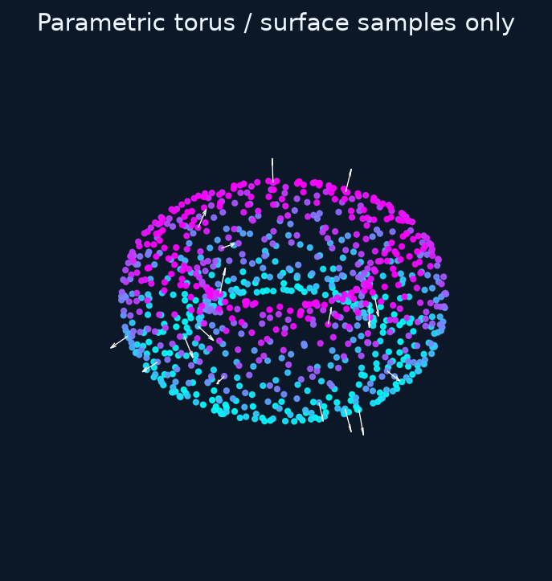

# Sampling parametric surfaces in 3D

A parametric surface maps two parameters to a spatial point:
$F(u,v)=(x(u,v),y(u,v),z(u,v))$. It provides surface samples and normals, without
sampling an enclosed volume or constructing surface triangles.

## Example: a torus

The major radius `R` measures the distance from the axis to the tube center;
the minor radius `r` measures the tube radius. Choose `R > r > 0` for this ring torus.

```python
import numpy as np
from rbflab import meshgen, viz

R, r = 1., .35
surface = meshgen.ParametricSurface3D(
    lambda u,v: ((R+r*np.cos(v))*np.cos(u),
                 (R+r*np.cos(v))*np.sin(u), r*np.sin(v)),
    u_range=(0,2*np.pi), v_range=(0,2*np.pi),
    periodic_u=True, periodic_v=True, label="torus",
    derivatives=(
        lambda u,v: (-(R+r*np.cos(v))*np.sin(u),
                      (R+r*np.cos(v))*np.cos(u), 0*u),
        lambda u,v: (-r*np.sin(v)*np.cos(u),
                     -r*np.sin(v)*np.sin(u), r*np.cos(v)),
    ),
)
cloud = meshgen.generate(surface, interior=0, boundary=900, seed=42)
fig, ax = viz.plot_cloud(cloud)
```



`interior=0` is required: this input describes a surface, not a volume.
All generated points belong to its `label`. The unified generator leaves the
surface object's stored samples unchanged and returns a regular 3D `PointCloud`.

## Parameters and normal convention

- `u_range`, `v_range`: finite increasing parameter intervals.
- `periodic_u`, `periodic_v`: declare a periodic seam; numerical derivatives wrap there.
- `derivatives`: optional pair of callables $(F_u,F_v)$. Without them, derivatives
  are approximated numerically by the surface implementation.
- `orientation=1`: normals follow $F_u\times F_v$; use `-1` to reverse them.
- `label`: the name of the sampled surface group.

The normalized cross product is the normal. Its orientation is defined by the
parameterization; there is no enclosing volume here from which to infer “outward.”
At a parameter singularity, the cross product may vanish and sampling is unsuitable.
Choose a regular parameterization or split it into appropriate patches.

## Why uniform parameters are not uniform surface area

The area factor is $J(u,v)=\lVert F_u\times F_v\rVert$. The sampler weights
acceptance by this Jacobian so large physical patches receive more samples than
small patches with the same parameter area. This is area-weighted sampling, not
a minimum-spacing guarantee. `max_candidates` controls the sampling search budget.

The surface API currently takes callables; the new symbolic planar-curve API is
separate. Sampling a surface does not automatically implement a surface PDE or a
Laplace–Beltrami operator. Use [3D volumes](volumes-3d.md) for ordinary volume PDEs.
