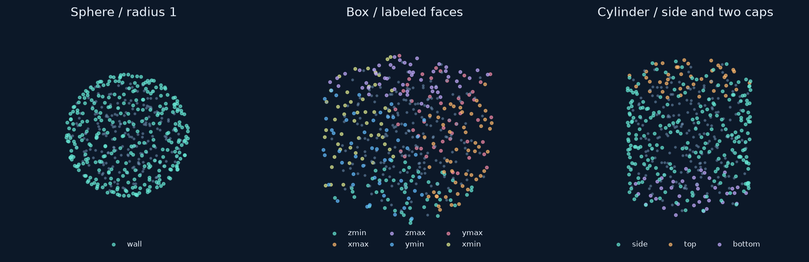
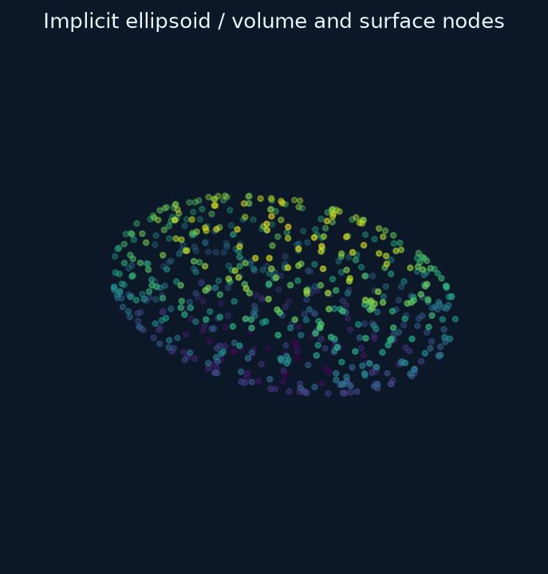

# Constructing 3D volumes

A volume cloud contains points **inside a solid region** and labeled points on
its enclosing surface. This is different from sampling a surface alone. Volume
clouds have three coordinate columns and can be used by supported 3D operators.

## Sphere, box and cylinder

```python
from rbflab import geometry as g, meshgen, viz

sphere = g.Sphere(center=(0,0,0), radius=1., boundary_label="wall")
box = g.Box(minimum=(-1,-1,-1), maximum=(1,1,1))
cylinder = g.Cylinder(center=(0,0,0), radius=.7, height=2., axis="z")
cloud = meshgen.generate(cylinder, interior=200, boundary=300, seed=42)
fig, ax = viz.plot_cloud(cloud)
```



Each panel uses 200 interior and 300 surface nodes. Substitute `sphere` or `box`
for `cylinder` in the generation call to obtain the other constructions.

| Constructor | Dimensions | Default surface labels |
|---|---|---|
| `Sphere(center=(0,0,0), radius=1)` | Positive radius and three-coordinate center | `boundary`, customizable with `boundary_label` |
| `Box(minimum=(-1,-1,-1), maximum=(1,1,1))` | Opposite axis-aligned corners; each maximum exceeds its minimum | `xmin`, `xmax`, `ymin`, `ymax`, `zmin`, `zmax` |
| `Cylinder(center=(0,0,0), radius=1, height=2, axis="z")` | Finite capped cylinder, centered axially at `center`; axis is `x`, `y`, or `z` | `side`, `bottom`, `top` |

A cylinder's `bottom` and `top` are its negative/positive **axial** caps; they are
not necessarily horizontal when the axis changes. Box and cylinder constructors
accept `boundary_labels={...}` to rename individual faces. For example,
`boundary_labels={"bottom":"inlet", "top":"outlet"}` renames the cylinder caps.
The optional `label` identifies the volume region and differs from a surface label.

The generator accepts a **total** 3D boundary count, not per-face counts. Surface
allocation follows the region sampler and areas. Inspect the returned groups if
a small face needs more resolution; exact per-face volume sampling is not exposed
through the unified `boundary` argument.

## Define a volume by an implicit function

Choose a scalar field that is negative inside and zero on the surface. Supply a
bounding box that encloses the whole region. For an ellipsoid with semi-axes
$(1.5,1,.65)$:

```python
ellipsoid = g.ImplicitRegion(
    lambda x,y,z: (x/1.5)**2 + y*y + (z/.65)**2 - 1,
    bounds=[(-1.5,1.5), (-1,1), (-.65,.65)],
    gradient=lambda x,y,z: (2*x/2.25, 2*y, 2*z/.65**2),
    boundary_label="wall",
)
cloud = meshgen.generate(ellipsoid, interior=240, boundary=400, seed=42)
```



Membership is `field(x,y,z) <= 0`. Boundary candidates are projected toward the
zero level set. The gradient points outward when the field uses this sign
convention; supplying it avoids numerical differentiation for normal/projection
calculations. The gradient may be omitted for smooth callable fields, with the
accuracy limitations of numerical derivatives.

| Optional input | Purpose |
|---|---|
| `gradient` | Accurate direction for projection and surface normals |
| `volume`, `surface_area` | Known geometric measures used by allocation/sampling routines |
| `clearance` | Positive physical distance to the boundary for interior points |
| `max_clearance` | Known largest possible clearance, when available |
| `label`, `boundary_label` | Separate names for material and surface groups |

A general implicit field is not a signed-distance function. Do not use its raw
value as physical clearance unless that interpretation is correct. A custom
clearance callback is needed when requesting a nonzero physical boundary distance.

Projection has a finite search budget and can fail on difficult or singular
fields. It does not guarantee uniform surface spacing, resolve arbitrary CAD
intersections, or generate tetrahedra. Check the cloud and boundary residuals
for a new implicit geometry.

## Volumes versus surfaces

A torus parameterization describes a 2D surface embedded in 3D. It does not by
itself provide membership in a solid torus. Use the separate
[parametric-surface interface](surfaces-3d.md) when surface samples are what you need.
The automatic symbolic differentiation added for planar curves does not currently
extend to arbitrary implicit fields or parametric surfaces.
