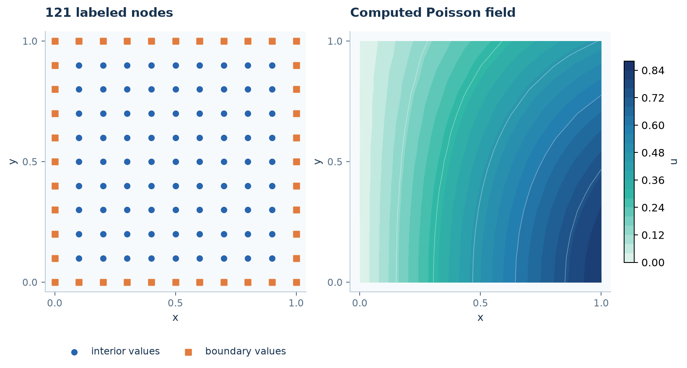

# Your first RBF problem

RBFLAB connects **nodes, an equation, an approximation, and a solution**.
This first problem uses the equation-driven interface on the unit square.
The [tutorial route](tutorials/index.md) then opens up the local weights and
sparse matrices used to write an algorithm yourself.

## Install and import

```sh
python -m pip install --upgrade "rbflab>=0.5"
```

The calculation below needs only the core package. Plotting is optional:
install `"rbflab[examples]"` for the last step. See [installation](INSTALL.md)
for virtual environments, C++ and PyTorch.

```python
import numpy as np
import sympy as sp
import rbflab as rbf
from rbflab import geometry
```

## 1. Describe the domain and its boundary

```python
--8<-- "examples/tutorials/first_problem.py:geometry"
```

The unit square has 81 interior nodes and 40 boundary nodes. The
`boundary` label connects the perimeter to its boundary equation.
No triangles are needed.
Geometry construction does not choose an equation or a numerical method.
Learn to compose other shapes in [Mesh generation](geometry/index.md).

## 2. Write the equation

We solve a Poisson problem with a known answer:

$$
-\Delta u=2\sin x\cos y\quad\text{in }\Omega,
\qquad u=\sin x\cos y\quad\text{on }\partial\Omega.
$$

Thus $u_{\mathrm{exact}}=\sin x\cos y$. Using a known solution lets us check the
numerical result; ordinary applications supply their own forcing and boundary data.

```python
--8<-- "examples/tutorials/first_problem.py:equation"
```

`SymbolicScalar(2)` supplies a scalar field and two spatial coordinates.
`stationary` declares a time-independent equation. The string `boundary` connects
the boundary equation to the nodes generated in step 1.

## 3. Choose RBF-FD and solve

```python
--8<-- "examples/tutorials/first_problem.py:solve"
```

`PHS(5)` selects a polyharmonic spline kernel. Each local stencil uses 35 nodes
and polynomials through degree three. The global matrix is sparse.

!!! note "What does `scaling="local"` do?"

    It uses each stencil's radius as the distance unit for the kernel. For example,
    a distance of 0.006 in a stencil of radius 0.02 becomes 0.3. The nodes stay in
    their physical positions, and RBFLAB automatically converts derivatives back
    to physical units when computing weights.

    This is a numerical scaling choice; it does not select more neighbors or
    increase precision. With this pure PHS kernel, the exact RBF-FD weights are
    unchanged, while roundoff can differ. Shape-dependent kernels such as IMQ
    need more care: [local scaling and kernel parameters](theory/conditioning.md#local-stencil-scaling).
    Omitting the policy uses `scaling="physical"`.

- **`problem`** describes the PDE and boundary equations.
- **`method`** chooses the approximation and its numerical settings.
- **`system`** holds the assembled algebraic problem.
- **`solution`** evaluates the computed field at requested coordinates.

The local stencil size must fit the cloud and be large enough for the polynomial
basis. These settings are a small example recipe, not universal accuracy defaults.

## 4. Check points that were not used in the solve

```python
--8<-- "examples/tutorials/first_problem.py:check"
```

The script prints a maximum error of about $2.12\times10^{-5}$ at 100
independently sampled interior points (seed 17).
It is a sampled solution error, not a bound over the whole square or the
residual of the linear solver. See [errors and residuals](theory/errors.md).



## 5. Plot with one library call

```python
from rbflab import viz
fig, ax = viz.plot_scalar(solution, bounds=((0, 1), (0, 1)), title="Poisson on a square")
fig.savefig("poisson.png", dpi=160)
```

The bounds set the visible square. The plotting grid only displays the solution;
it does not change the numerical nodes.

[Download this self-contained script](https://raw.githubusercontent.com/LDBreton/RBFLAB/main/examples/tutorials/first_problem.py),
or run `python -m examples.tutorials.first_problem --plot poisson.png` from a
source checkout. `pip install rbflab` installs the library; it does not install
the repository's `examples` directory as a Python package.

## Choose the next level of control

| You want to… | Continue with… |
|---|---|
| Follow the main learning route | [Six tutorials](tutorials/index.md) |
| Understand local derivative weights | [From samples to operators](tutorials/local-approximation.md) |
| Assemble and time-step sparse operators | [Stationary PDE](tutorials/custom-assembly.md) and [heat](tutorials/heat-equation.md) |
| Change domain or physics | [Gallery and advanced applications](gallery/index.md) |

Changing methods or backends is a separate decision from changing the equation.
Compare errors whenever you change kernels, stencil rules or precision.
