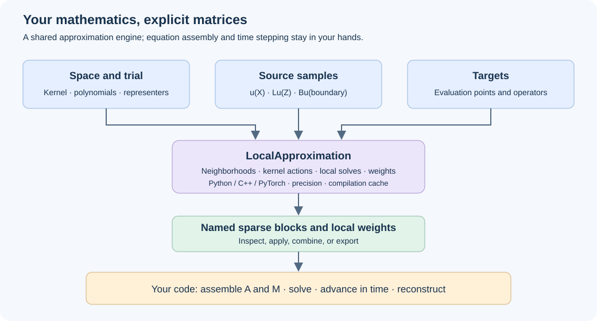

# Construct your method from approximation maps

A numerical method has several independent choices: the space, its trial
functions, the sampled data, the quantities to evaluate, and the equations that
use the resulting maps. `LocalApproximation` makes these choices visible.

## Start at the level you need

| Goal | Entry point | Result |
|---|---|---|
| Fit scattered values globally | `interpolate` | An interpolant with evaluation and derivatives |
| Construct local RBF-FD or Hermite maps | `LocalApproximation` | Named sparse blocks and local weights |
| Enforce global PDE collocation | `GlobalCollocation` | A coefficient-based system |
| Use existing packaged PDE assembly | `RBFFD` or `LHI` | A problem-specific system and solution |

The last row is retained for compatibility and specialized formulations. New
research examples use the common local construction. LHI remains a mathematical
method: its local PDE and boundary functionals are built into the approximation,
not added afterward to ordinary nodal RBF-FD weights.

### Which paths already share the engine?

Standard `RBFFD.operators` and `.weights` delegate to `LocalApproximation`.
Their compatibility adapter keeps SciPy matrices even for Torch local
construction. Direct `LocalApproximation` retains native matrix storage.
Scalar `LHI.assemble` also uses the shared weight engine, while its adapter
retains the earlier known-data assembly and solution reconstruction.

Specialized Stokes and coupled-block convenience implementations still have
separate assembly paths. The new engine supports scalar spaces and
componentwise functionals on `DivergenceFreeSpace` in 2D/3D; this is not automatic
mixed `SymbolicSystem` or velocity-pressure assembly. Vector samples are ordered
node-major, and their matrix blocks contain component-to-component coupling.

## Five mathematical objects

| Object | Meaning |
|---|---|
| `ScalarSpace` or another supported space | Kernel, polynomial enrichment, field structure |
| `Samples(points, operator=..., size=...)` | What is sampled and how its local neighborhood is chosen |
| `space.representers(source)` | Trial functions made by applying source functionals to the kernel's second argument |
| `space.translates(points)` | Ordinary kernel translates, independently specified |
| `local.operators(targets=..., operators=...)` | Evaluate requested functionals of each local approximation |

For ordinary value samples, matching representers are ordinary translates. For
Hermite data they include the appropriate kernel derivatives. An explicit trial
can differ from the data functional construction. A differentiated trial alone
does not guarantee a symmetric matrix.

See the complete [operator tutorial](../tutorials/local-approximation.md), then
[LHI and heat from matrices](../tutorials/lhi-matrices.md).

## Named blocks keep the equation visible

Suppose an approximation gives

$$\tau u\approx W_uU+W_fF+W_bG.$$

`ops.tau["u"].matrix`, `ops.tau["pde"].matrix`, and
`ops.tau["boundary"].matrix` expose these three maps. Applying the operator to a
mapping of data sums the blocks. Their concatenation is available through
`ops.tau.matrix`; its columns follow source declaration order.

The maps do not permanently classify a sample as known or unknown. In a
stationary equation, $F=f$. In an evolution equation, $F=f-u_t$. That distinction
belongs to the user's equation and changes its mass/forcing contributions.

## Inspect and modify

`.local(i)` exposes local weights and membership. `.reconstruct_local(i)` rebuilds
the local augmented matrix and target right-hand side on demand. The dense
systems are not stored for every target. `.weights(target=..., operator=...)`
provides the corresponding single-target construction from the configured source
groups.

For the square augmented system $H$, weights solve

$$H^T\begin{bmatrix}w\\\eta\end{bmatrix}=q_\tau.$$

The polynomial multipliers $\eta$ are local algebra, not extra global unknowns.
See [the derivation](../theory/local-weights.md). Neither successful factorization
nor a small local residual proves global stability.

## Numerical execution

Select neighborhood/scaling policy, arithmetic, and local factorization
independently of the differential equation. Python, C++, and Torch execute the
supported local construction; selecting one does not move your SciPy global
solve or time loop onto that backend.

- Python provides the reference numerical path and supported extended arithmetic.
- C++ provides native local construction with Float64 or MPFR; its optional source
  toolchain is described in [installation](../INSTALL.md).
- Torch provides supported tensor-based local construction; current documented
  examples use CPU Float64. This interface does not imply a GPU-resident or
  end-to-end differentiable PDE solve.

Only advertise a backend/space combination after checking
[capabilities](../CAPABILITIES.md). `Precision(local_digits=50)` alone does not
request extended precision for a separate SciPy solve. Full extended sparse
storage uses the supported `global_dtype="mpmath"` path; convert neither matrix
nor data to Float64 if preserving that arithmetic matters.

`StencilPolicy(scaling="local")` normalizes kernel coordinates. This is separate
from algebraic equilibration in a local solver. Shape-sensitive kernels change
meaning under coordinate normalization. See [conditioning](../theory/conditioning.md).

## Select exact or geometric source neighborhoods

`Samples.size` selects nearby points independently for each source group.
`target="allow"`, `"exclude"`, or `"require"` controls coincident-point membership.
To reproduce a specific paper stencil, supply `indices=[...]`, one row of
group-local integer indices per target, instead of a size/selection policy.
Normal-dependent boundary samples accept `normals=...`; geometry can supply
these through its labeled boundary data. A per-group `policy` controls selection;
coordinate scaling belongs to the whole `LocalApproximation`.

## Compilation and reuse

Kernel derivative preparation and compilation can be cached across compatible
requests. A compiled expression can be reused when parameters change; numerical
factorizations generally cannot. Do not treat compilation caching as a promise
that stencil matrices or weights remain valid after changing geometry or kernels.

## Evolution is a matrix algorithm

Construct $M$, $A$, and $b(t)$, then write the integrator:

$$M\dot U+AU=b(t).$$

Backward Euler solves $(M/\Delta t+A)U^{n+1}=MU^n/\Delta t+b(t_{n+1})$.
BDF2 or a projection method uses the same spatial maps. No library evolution
object is required. Boundary elimination and constraints remain visible in the
matrix construction. Do not assume that a constrained mass matrix is invertible.

Existing symbolic evolution conveniences remain available; see
[the heat comparison](../tutorials/heat-equation.md). Global collocation still
uses expansion coefficients, while local maps act on named sampled data. Keeping
those interpretations explicit is more important than giving every method the
same solver wrapper.
