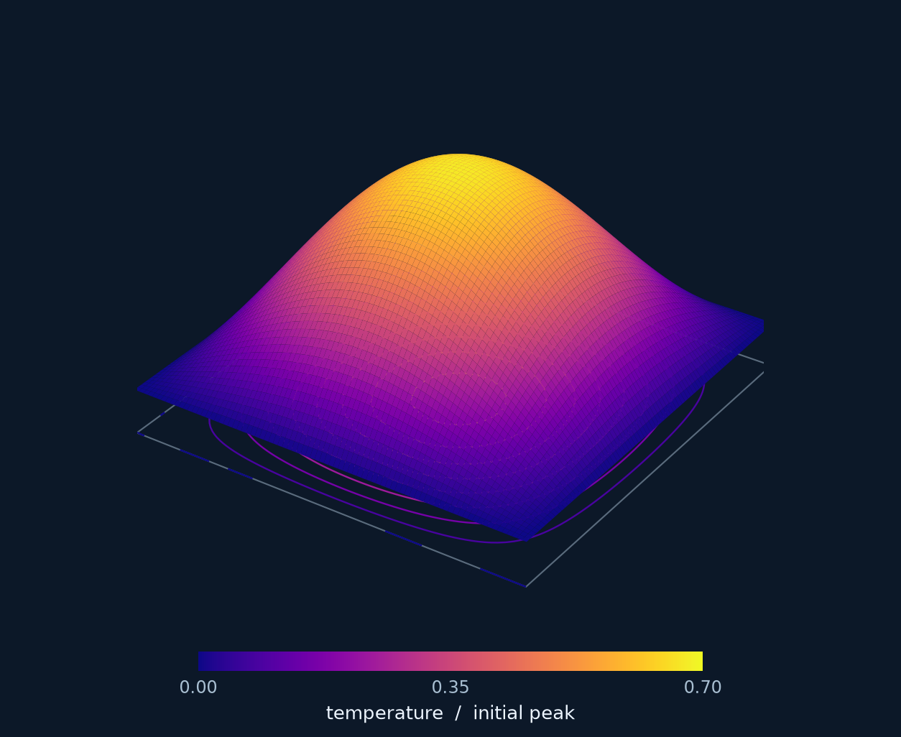
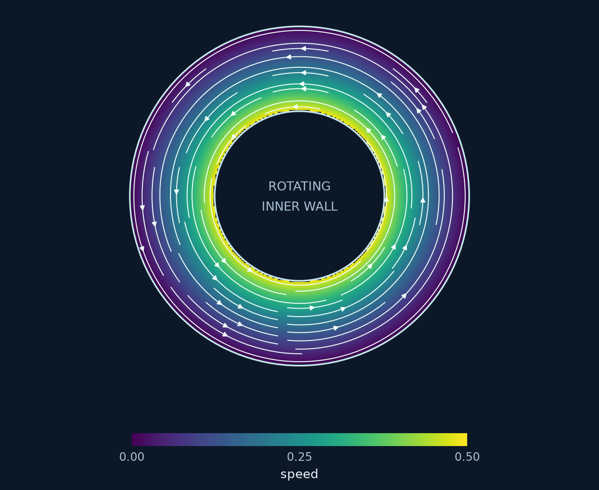

<section class="rbf-hero" aria-labelledby="manual-title">

RBFLAB · Scientific computing in Python

<h1 id="manual-title">Radial basis functions. From equations to solutions.</h1>

A practical manual for interpolation and partial differential equations on point clouds. Write equations symbolically, choose a numerical method, and work directly with the matrices behind the solution.

<a class="rbf-button rbf-button--primary" href="getting-started/">Solve your first PDE →</a>
<a class="rbf-button" href="tutorials/heat-equation/">Learn through the heat equation</a>

<code>pip install rbflab</code>Python 3.11+ · Open source · Version 0.3.0

</section>

<figure class="rbf-feature">

<figcaption class="rbf-caption">Named boundaries, curved holes, concave polygons and 3D volumes. <a href="geometry/cookbook/">Build your geometry →</a></figcaption>
</figure>

<h2 id="explore">Explore the manual</h2>

<section class="rbf-chapter">
01

<h3><a href="getting-started/">Getting started</a></h3>
Install the library and solve a Poisson problem. Connect the equation, point cloud, discretization, and solution.

</section>
<section class="rbf-chapter">
02

<h3><a href="tutorials/one-stencil/">Learning by examples</a></h3>
Build one stencil, assemble heat matrices, impose boundary conditions, and move on to Stokes and 3D problems.

</section>
<section class="rbf-chapter">
03

<h3><a href="theory/">Mathematical foundations</a></h3>
Understand kernel conventions, polynomial constraints, local Hermite systems, conditioning, and error measures.

</section>
<section class="rbf-chapter">
04

<h3><a href="api/discretizations/">Python API reference</a></h3>
Inspect operators, local weights, sparse matrices, spaces, precision settings, and the available backends.

</section>

<h2 id="methods">One problem, several numerical methods</h2>

Keep the equation and cloud, then change the approximation. The manual explains what each system solves for and how to assess its result.

<table>
<thead><tr><th>Method</th><th>Global unknowns</th><th>Matrix</th></tr></thead>
<tbody>
<tr><td><a href="tutorials/global-lhi/">Global collocation</a></td><td>Kernel expansion coefficients</td><td>Dense</td></tr>
<tr><td><a href="tutorials/global-lhi/">Local Hermite interpolation</a></td><td>Interior solution-center values</td><td>Sparse</td></tr>
<tr><td><a href="tutorials/one-stencil/">RBF finite differences</a></td><td>Nodal values</td><td>Sparse</td></tr>
<tr><td><a href="tutorials/stokes/">Divergence-free Stokes</a></td><td>Velocity and pressure-space coefficients</td><td>Coupled</td></tr>
</tbody>
</table>

<h2 id="curved">Beyond the square</h2>

<article class="rbf-example">
<h3><a href="tutorials/flower-heat/">Heat on a flower</a></h3>
Symbolic forcing, evolving boundary data and a reusable animation call.

</article>
<article class="rbf-example">
<h3><a href="tutorials/ellipse/">Curved boundary conditions</a></h3>
Dirichlet, Neumann and Robin conditions on one labeled ellipse.

</article>
<article class="rbf-example">
<h3><a href="tutorials/ball/">Into three dimensions</a></h3>
A nonpolynomial manufactured solution inside a ball.

</article>

<h2 id="examples">See the methods at work</h2>

<article class="rbf-example">

<h3><a href="tutorials/heat-equation/">Heat equation</a></h3>
Five-point FD, RBF-FD matrices, and symbolic assembly for the same problem.

</article>
<article class="rbf-example">

<h3><a href="tutorials/annular-stokes/">Divergence-free Stokes</a></h3>
Rotating-cylinder flow in an annulus, with measured velocity and pressure-gradient errors.

</article>
<article class="rbf-example">

<h3><a href="tutorials/cavity/">Lid-driven cavity</a></h3>
A custom Navier–Stokes algorithm, with diagnostics and explicit validation limits.

</article>

Computed fields, rendered for a closer look: RBF-FD heat at t = 0.02, steady annular Stokes, and the coarse Re = 100 cavity at t = 20. The cavity is an illustrative run, not a grid-converged benchmark.

<aside class="rbf-note">
<strong>Designed for exploration.</strong> The core runs with Python, NumPy, and SciPy. Optional C++ and PyTorch backends accelerate supported local methods. Check the <a href="CAPABILITIES/">capability table</a> for dimensions, precision, and method support, or follow the <a href="INSTALL/">installation guide</a>.
</aside>

Tutorial module commands run from a source checkout. The curved tutorials use a shared helper in the examples folder; keep that folder together. The cavity wrapper also uses its maintained example solver.

