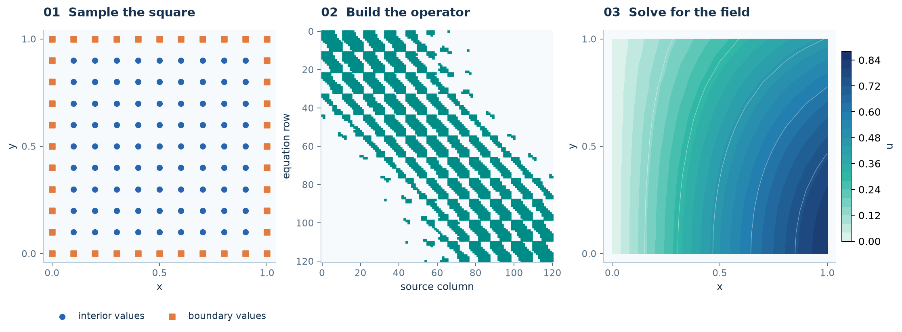

<section class="rbf-hero" aria-labelledby="manual-title">

RBFLAB · Scientific computing in Python

<h1 id="manual-title">From scattered nodes to a numerical solution.</h1>

RBFLAB is a Python library for radial basis function interpolation and PDEs on point clouds. The six-tutorial route uses the unit square to connect mathematical ideas, library objects, and computed results.

<a class="rbf-button rbf-button--primary" href="tutorials/">Start the tutorials →</a>
<a class="rbf-button" href="getting-started/">Solve a first problem</a>
<a class="rbf-button" href="INSTALL/">Install RBFLAB</a>

<code>python -m pip install "rbflab>=0.5"</code>Python 3.11+ · Version 0.5.0 learning path

</section>

<figure class="rbf-feature">

<figcaption class="rbf-caption">The same basic workflow runs through the lessons: nodes → operators → solution. <a href="tutorials/">Follow the route →</a></figcaption>
</figure>

<h2>Choose where to begin</h2>

<section class="rbf-chapter">01
<h3><a href="getting-started/">First problem</a></h3>
Declare a Poisson equation and inspect its solution on a square cloud.

</section>
<section class="rbf-chapter">02
<h3><a href="tutorials/">Six tutorials</a></h3>
Move from interpolation to local operators, stationary equations, global and Hermite methods, then heat evolution.

</section>
<section class="rbf-chapter">03
<h3><a href="gallery/">Gallery and advanced</a></h3>
Apply the same ideas to curved boundaries, holes, 3D domains, and coupled flow.

</section>
<section class="rbf-chapter">04
<h3><a href="theory/">Mathematics and API</a></h3>
Use the derivations, capability table, and reference while changing a numerical method.

</section>

The core lessons use Python and the release 0.5 local interface. Global interpolation and collocation have separate coefficient-based APIs. See <a href="CAPABILITIES/">capabilities</a> for backend and method support.

