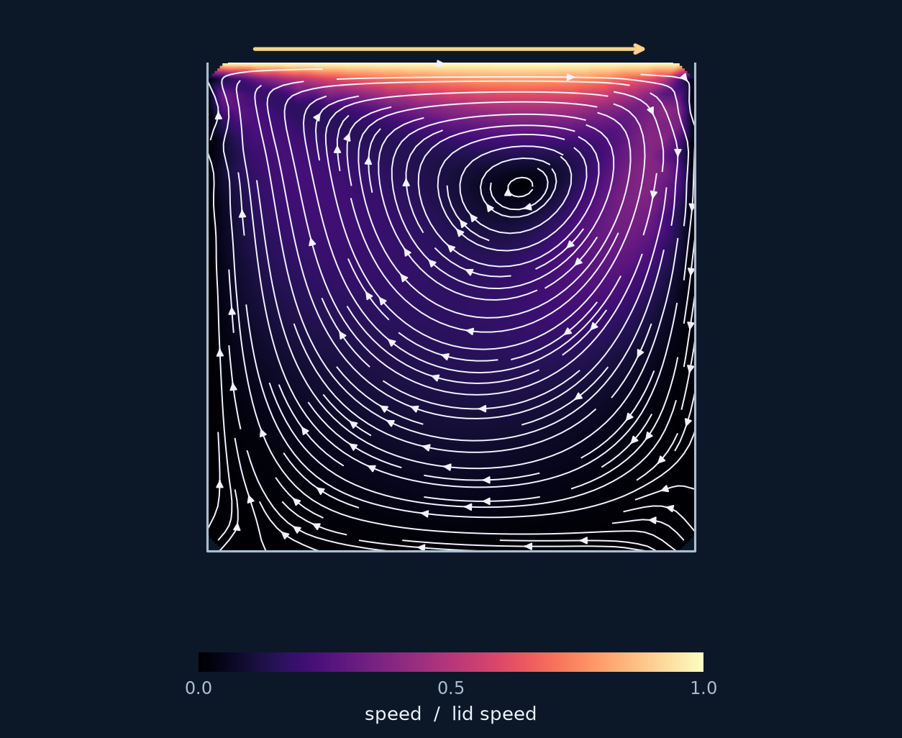

<section class="rbf-hero" aria-labelledby="manual-title">

RBFLAB · Scientific computing in Python

<h1 id="manual-title">Radial basis functions. From equations to solutions.</h1>

A Python library for interpolation and PDEs on scattered nodes. Start with an equation and a curved domain, or build local weights and sparse operators for your own algorithm. The tutorials connect each mathematical choice to the Python object that represents it.

<a class="rbf-button rbf-button--primary" href="getting-started/">Solve your first PDE →</a>
<a class="rbf-button" href="tutorials/local-approximation/">Build your operators</a>
<a class="rbf-button" href="INSTALL/">Install Python or C++</a>

<code>pip install rbflab</code>Python 3.11+ · Open source · Version 0.5.0

</section>

<figure class="rbf-feature">

<figcaption class="rbf-caption">Named boundaries, curved holes, concave polygons and 3D volumes. <a href="geometry/planar-domains/">Build your geometry →</a></figcaption>
</figure>

<h2 id="explore">Explore the manual</h2>

<section class="rbf-chapter">
01

<h3><a href="getting-started/">Getting started</a></h3>
Install the library and solve a Poisson problem. Connect the equation, point cloud, discretization, and solution.

</section>
<section class="rbf-chapter">
02

<h3><a href="tutorials/">Tutorials</a></h3>
Follow the mathematics into code: interpolate data, solve PDEs on curved domains, and assemble your own sparse algorithm.

</section>
<section class="rbf-chapter">
03

<h3><a href="theory/">Mathematical foundations</a></h3>
Understand kernel conventions, polynomial constraints, local Hermite systems, conditioning, and error measures.

</section>
<section class="rbf-chapter">
04

<h3><a href="api/discretizations/">Python API reference</a></h3>
Inspect operators, local weights, sparse matrices, spaces, precision settings, and the available backends.

</section>

<h2 id="local-api">From approximation to your algorithm</h2>

RBFLAB 0.5 makes ordinary RBF-FD and Hermite constructions explicit through <code>LocalApproximation</code>. <a href="tutorials/local-approximation/">Declare source functionals and target operators</a>, then <a href="tutorials/lhi-matrices/">assemble LHI and a heat time loop with sparse matrices</a>. Install or upgrade to <code>rbflab&gt;=0.5</code> to use these interfaces.

<figure class="rbf-feature"></figure>

<h2 id="methods">One problem, several numerical methods</h2>

Keep the equation and cloud, then change the approximation. The manual explains what each system solves for and how to assess its result.

<table>
<thead><tr><th>Method</th><th>Global unknowns</th><th>Matrix</th></tr></thead>
<tbody>
<tr><td><a href="tutorials/global-collocation/">Global collocation</a></td><td>Kernel expansion coefficients</td><td>Dense</td></tr>
<tr><td><a href="tutorials/lhi/">Local Hermite interpolation</a></td><td>Interior solution-center values</td><td>Sparse</td></tr>
<tr><td><a href="tutorials/one-stencil/">RBF finite differences</a></td><td>Nodal values</td><td>Sparse</td></tr>
<tr><td><a href="tutorials/annular-stokes/">Divergence-free Stokes</a></td><td>Velocity and pressure-space coefficients</td><td>Coupled</td></tr>
</tbody>
</table>

<h2 id="examples">Choose a problem and see how it works</h2>

For a guided learning sequence, choose <a href="tutorials/">interpolation, PDEs, or custom algorithms</a>. Instructors can use the <a href="tutorials/teaching/">teaching guide and modification exercises</a>.

<article class="rbf-example">
<h3><a href="tutorials/perforated-poisson/">Poisson with holes</a></h3>
Geometry, labels, symbolic forcing and a measured solution error.

</article>
<article class="rbf-example">
<h3><a href="tutorials/flower-heat/">Heat on a flower</a></h3>
Solve a forced transient equation with nonzero boundary data on a curved domain.

</article>
<article class="rbf-example">
<h3><a href="tutorials/cavity/">Build a flow algorithm</a></h3>
Staggered maps, wall values, convection and the full pressure–velocity block solve.

</article>

Each tutorial states its equations, numerical recipe and limitations. The cavity image illustrates an experimental coarse-cloud demonstration with a measured divergence defect; it is not a benchmark result. <a href="tutorials/">Explore the full learning route →</a>

<aside class="rbf-note">
<strong>Designed for exploration.</strong> The core runs with Python, NumPy, and SciPy. Optional C++ and PyTorch backends accelerate supported local methods. Check the <a href="CAPABILITIES/">capability table</a> for dimensions, precision, and method support, or follow the <a href="INSTALL/">installation guide</a>.
</aside>

Tutorial module commands run from a source checkout. Some tutorials use a shared helper in the examples folder; keep that folder together. The cavity chapter shows the maintained solver itself, including assembly and the time loop.

