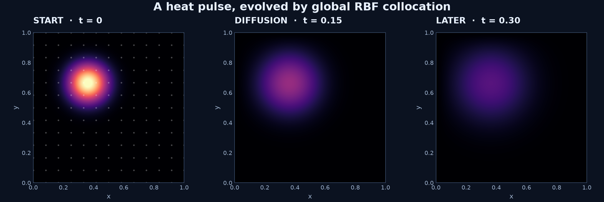

# RBFLAB user manual

RBFLAB is a point-cloud library for radial basis function interpolation and PDEs. Its Python API supports global collocation, local Hermite interpolation (LHI), RBF-FD, symbolic equations, and divergence-free spaces. This manual teaches how each method turns an equation into a matrix, what the unknown vector means, and how to assess a computed result.

## Choose a path

**New to the library?** [Install RBFLAB](INSTALL.md), [solve one symbolic Poisson problem](getting-started.md), then [build a single RBF-FD stencil](tutorials/one-stencil.md). The [heat equation](tutorials/heat-equation.md) carries the same PDE through classical finite differences, explicit RBF-FD matrices, and the symbolic API.

**Working on a PDE method?** Start with [interpolation](tutorials/interpolation.md), compare [global collocation, LHI, and RBF-FD](tutorials/global-lhi.md), then inspect the [mathematical foundations](theory/rbf-fd.md) and [discretization API](api/discretizations.md). Local weights, sparse matrices, and reconstructed systems are available to researchers implementing their own algorithms.

**Working on flow?** The [Stokes tutorial](tutorials/stokes.md) uses a divergence-free velocity space and a pressure space modulo constants. The [cavity tutorial](tutorials/cavity.md) shows how to reuse operators inside a custom Navier–Stokes algorithm and states its present validation limits.

## Method at a glance

| Method | Main global unknown | Matrix | First example |
|---|---|---|---|
| Global collocation | Kernel expansion coefficients | Dense | [Poisson comparison](tutorials/global-lhi.md) |
| LHI | Interior solution-center values | Sparse, from local Hermite systems | [Poisson comparison](tutorials/global-lhi.md) |
| RBF-FD | Nodal values | Sparse, from local value-interpolation weights | [One stencil](tutorials/one-stencil.md) |
| Divergence-free Stokes | Velocity/pressure space coefficients | Coupled | [Steady and unsteady Stokes](tutorials/stokes.md) |

The tutorial module commands run from a source checkout. A downloaded standalone script can also run with the installed package as `python script.py`; the cavity wrapper additionally needs the maintained solver in `examples/navier_stokes_cavity.py`.

The [capability table](CAPABILITIES.md) records supported dimensions, schemes, and backends. The standard installation is Python-only; optional compiled, PyTorch, Gmsh, and extended-precision workflows are described in [installation](INSTALL.md).

The smooth display grid samples the computed heat field; the faint dots show numerical nodes. See [visualization](VISUALIZATION.md) for the corresponding tools.
