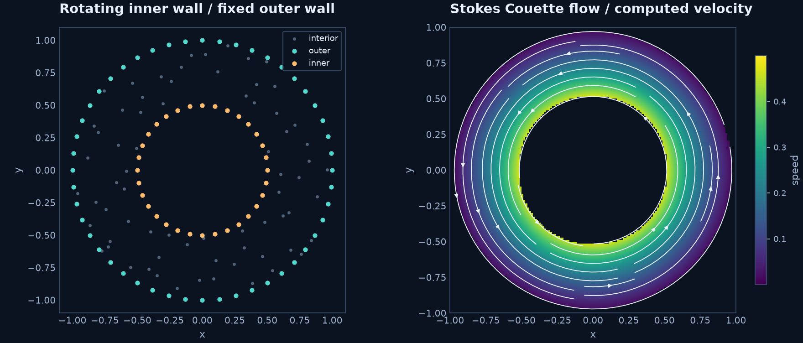

# Stokes flow between rotating cylinders

<figure class="method-detail"><figcaption>Computed speed and streamlines for the annular Stokes example below. The inner wall rotates and the outer wall is fixed.</figcaption></figure>

Consider a two-dimensional annular cross-section, inner radius $a=0.5$ and outer
radius $b=1$. The inner cylinder rotates with angular speed one; the outer wall
is fixed. In the **steady Stokes** model,

$$
-\mu\Delta\boldsymbol u+\nabla p=0,\qquad \nabla\cdot\boldsymbol u=0,
\qquad \mu=1.
$$

The azimuthal solution is

$$
u_\theta(r)=Ar+B/r,\quad A=-\tfrac13,\quad B=\tfrac13,
\qquad \boldsymbol u=(-y,x)\,\frac{1/r^2-1}{3},\quad \nabla p=0.
$$

There is no convective acceleration in this model. Do not interpret its constant
pressure as the radial pressure distribution of finite-inertia rotating flow.

```python
spaces = {
    U: rbf.DivergenceFreeSpace(rbf.IMQ(3), 2),
    p: rbf.PressureSpace(rbf.IMQ(3), 1),
}
method = rbf.GlobalCollocation(spaces=spaces)
```

The velocity kernel is constructed from the Hessian/Laplacian of a scalar kernel;
its columns are divergence-free. The equation list therefore contains momentum,
with incompressibility supplied by the space. Pressure is represented modulo
constants. See [divergence-free mathematics](../theory/divergence-free.md).



```sh
python -m examples.stokes_annulus
```

This small example uses the Python global space assembler, 70 Halton interior
nodes and 80 boundary nodes (150 total), seed 42, IMQ parameter 3, velocity
polynomial degree 2, pressure degree 1, and Float64. C++/Torch selection in the
other curved examples applies to local scalar RBF-FD; it does not accelerate
this global space assembly.

The default independent sampled velocity error is about $4.0\times10^{-3}$.
Divergence evaluates to zero in this run. The pressure-gradient error is about
$4.6\times10^{-2}$: the velocity picture alone is not a pressure-accuracy claim.
Keep the [existing manufactured Stokes example](stokes.md), with nonconstant
pressure, as a separate regression check.

??? example "Complete runnable source"

    ```python
    --8<-- "examples/stokes_annulus.py"
    ```

**Try next:** refine the cloud with the same space parameters and compare velocity
and pressure-gradient errors separately.
