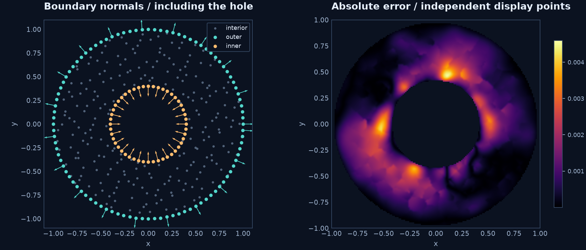

# Laplace on an annulus

A hole changes both domain membership and the direction of the inner normal.
This example solves a known harmonic field before trying a more complex geometry.

$$
\Omega=\{(x,y):a<r<b\},\quad -\Delta u=0,\quad
u(a)=0,\quad u(b)=1,\qquad
u(r)=\frac{\log(r/a)}{\log(b/a)}.
$$

Here $a=0.4$ and $b=1$. Start with 240 Halton interior nodes, 48 inner and 96
outer boundary nodes, seed 42. All arithmetic is Float64.

```python
import sympy as sp
import rbflab as rbf
from rbflab import geometry, meshgen

domain = geometry.Annulus(.4, 1.)
cloud = meshgen.generate(domain, interior=240,
                         boundary={"inner": 48, "outer": 96}, seed=42)
m = rbf.SymbolicScalar(2)
u = m.field
problem = m.stationary(sp.Eq(-m.laplacian(u), 0), boundary=[
    m.bc("inner", sp.Eq(u, 0)), m.bc("outer", sp.Eq(u, 1)),
])
method = rbf.RBFFD(rbf.PHS(5), 35, polynomial_degree=3,
                  local_backend=rbf.CppBackend(threads=4, compute_condition=False),
                  stencil_policy=rbf.StencilPolicy(scaling="local"))
solution = problem.solve(cloud, method)
```

Use `PythonBackend(compute_condition=False)` for a compiler-free run, or
`TorchBackend(threads=4, compute_condition=False)` with the optional tensor package.
See [backend setup](../guides/curved-backends.md). PHS uses $\phi(r)=r^5$ with all
polynomials through degree three; the fixed 35-node stencil policy is shared.



## Compare methods

```sh
python -m examples.annulus --method rbffd --backend cpp
python -m examples.annulus --method rbffd --backend torch
python -m examples.annulus --method global
python -m examples.annulus --method lhi
```

Global asymmetric collocation uses the same PHS/polynomial family over all nodes.
LHI uses its local Hermite functional systems; RBF-FD uses local value interpolation.
These are different discretizations even when the cloud and kernel agree.

On the default cloud, independent sampled maximum errors are about $3.1\times10^{-3}$
(RBF-FD), $1.8\times10^{-3}$ (global), and $3.1\times10^{-3}$ (LHI).
These are solution errors against the logarithmic formula, not sparse residuals.
The query points use an independent seed. See the [validation record](../guides/curved-validation.md).

??? example "Complete runnable source"

    ```python
    --8<-- "examples/annulus.py"
    ```

The common [example helper](https://github.com/LDBreton/RBFLAB/blob/main/examples/_curved.py)
selects backends, measures stages and reports errors; it contains no hidden PDE formulation.

**Try next:** change the inner radius, then refine both interior and boundary counts.
Keep kernel and stencil settings fixed across seeds when assessing consistency.
