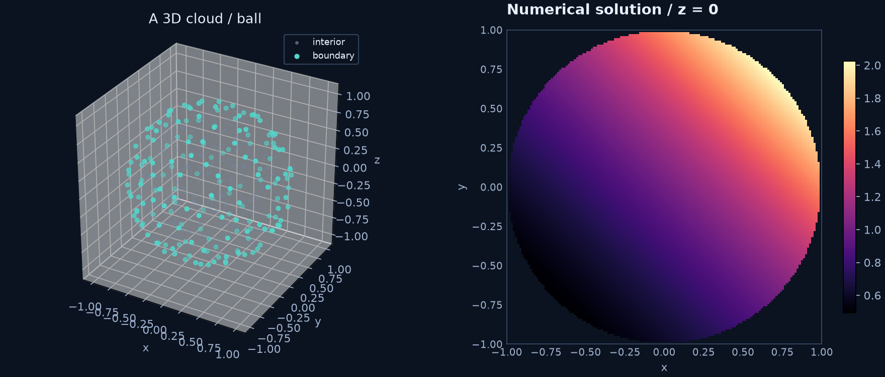

# A 3D Poisson problem inside a ball

The geometry and scalar RBF-FD API work in three dimensions. A nonpolynomial
manufactured solution tests more than exact polynomial reproduction:

$$
\Omega=\{\boldsymbol x:\|\boldsymbol x\|<1\},\qquad
u_{\rm exact}=e^{(x+y+z)/2},\qquad -\Delta u=-\tfrac34 e^{(x+y+z)/2}.
$$

Set $u=u_{\rm exact}$ on the sphere.

```python
domain = geometry.Sphere()
cloud = meshgen.generate(domain, interior=300, boundary=180, seed=42)
model = rbf.SymbolicScalar(3)
```

All subsequent operators use dimension three. The default method uses 55-node
RBF-FD stencils, PHS5, all degree-three polynomials (20 terms), local scaling and
Float64. The independent sampled maximum error is about $2.0\times10^{-4}$.



```sh
python -m examples.ball_poisson --backend cpp --plot ball.png
python -m examples.ball_poisson --backend torch
```

`viz.plot_slice(solution, domain, axis=2, coordinate=0)` samples the solved field
in the plane $z=0$ and masks points outside the ball. These points are for display,
not a hidden structured discretization. No tetrahedral connectivity is generated.

??? example "Complete runnable source"

    ```python
    --8<-- "examples/ball_poisson.py"
    ```

**Try next:** use an ellipsoidal `ImplicitRegion` with its analytic gradient and
repeat the manufactured-solution test. 3D scalar support does not imply a 3D
staggered Navier–Stokes implementation.
