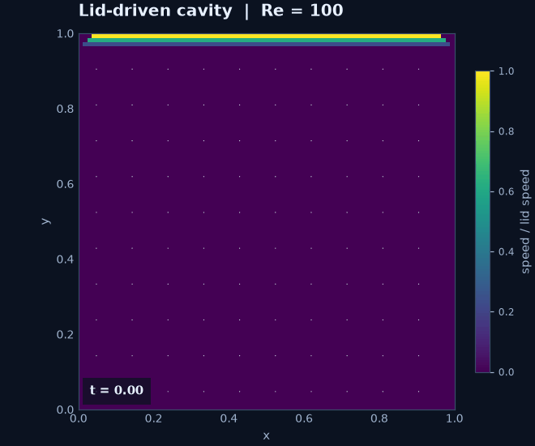
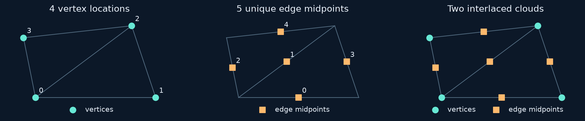

# Build a lid-driven cavity solver

**Goal:** assemble a coupled nonlinear evolution algorithm from reusable maps.
First work through [custom sparse assembly](custom-assembly.md),
[heat time stepping](heat-equation.md), and [coupled fields](annular-stokes.md).
This lesson uses scalar velocity spaces and a separate continuity equation.




This example shows how to build a nonlinear time-dependent algorithm from RBFLAB's
**source-to-target RBF-FD matrices**. We follow the actual implementation in
`examples/navier_stokes_cavity.py`, from the point sets to the sparse block solve.
The animation uses 800 velocity nodes, 289 pressure nodes and $t=20$; it is an
illustration, not a grid-converged benchmark.

## 1. Model and boundary data

With unit density, solve on $\Omega=(0,1)^2$:

$$\partial_t\boldsymbol u+(\boldsymbol u\cdot\nabla)\boldsymbol u
-\nu\Delta\boldsymbol u+\nabla p=0,\qquad \nabla\cdot\boldsymbol u=0.$$

The top lid has $(u,v)=(1,0)$; the other three walls have $(0,0)$. The interior
starts at rest, with the lid applied immediately. Unit length and lid speed give
$\mathrm{Re}=1/\nu=100$ for $\nu=0.01$. The abrupt lid/side transition creates a
corner singularity; this example does not smooth or ramp the lid.

Velocity components use **scalar** RBF spaces here. They are not divergence-free
by construction. Incompressibility is represented through a separate block of
discrete equations. This differs from the [divergence-free Stokes example](annular-stokes.md).

## 2. Two point sets and three operator maps

The square is split into triangles. Pressure nodes are its vertices; velocity
nodes are the midpoints of unique triangle edges, including the diagonals.
For `cells=c`, there are $(c+1)^2$ pressure nodes and $3c^2+2c$ velocity nodes.
Boundary velocity midpoints avoid placing a velocity unknown exactly at a corner.



The picture explains the construction on two triangles. The solver's regular
square uses the same unique-edge idea. Here is its complete cloud construction:

??? example "Construct the cavity clouds"

    ```python
    --8<-- "examples/navier_stokes_cavity.py:clouds"
    ```

PHS7, polynomials through degree three, and 28-node stencils are used for both
fields. `PressureSpace` describes the pressure approximation; it does not impose
the mean constraint used later.

```python
--8<-- "examples/navier_stokes_cavity.py:operators"
```

These statements are inside `solve`; `local` is its selected Python or C++ backend.
Read a map name as **source, target**:

| Code | Source values | Evaluation locations | Matrix dimensions |
|---|---|---|---|
| `vv.dx`, `vv.dy`, `vv.lap` | Velocity nodes | Velocity nodes | $N_v\times N_v$ |
| `vp.dx`, `vp.dy` | Velocity nodes | Pressure nodes | $N_p\times N_v$ |
| `pv.dx`, `pv.dy` | Pressure nodes | Velocity nodes | $N_v\times N_p$ |

Write $d_x,d_y,L$ for the first row, $D_x,D_y$ for the second, and $G_x,G_y$ for
the third. The same scalar operators act on both velocity components. These are
independently constructed collocation maps: **$D$ is not imposed as $-G^T$**.
The example does not assemble a pressure Poisson matrix or perform a projection step.

## 3. Discretize convection and diffusion

At velocity nodes, the advective form is

$$C^n=\operatorname{diag}(u^n)d_xU^n+\operatorname{diag}(v^n)d_yU^n,$$

where $U^n$ is the $N_v\times2$ array of velocity components. In code:
`u[:,0,None]*(dx @ u) + u[:,1,None]*(dy @ u)`.
There is no upwinding, hyperviscosity or skew-symmetric energy correction in this example.

Use Adams–Bashforth extrapolation
$\widehat C^{n+1/2}=\tfrac32C^n-\tfrac12C^{n-1}$, with $\widehat C^{1/2}=C^0$
for startup. Crank–Nicolson diffusion gives

$$A=\Delta t^{-1}I-\tfrac{\nu}{2}L,\qquad
B=\Delta t^{-1}I+\tfrac{\nu}{2}L,$$

$$AU^{n+1}+G\pi=B U^n-\widehat C^{n+1/2}.$$

Here $G\pi$ means the two columns $(G_x\pi,G_y\pi)$. The pressure unknown $\pi$
is the multiplier for this time step (naturally a midpoint pressure in the CN
momentum equation); it is not advanced through an independent pressure evolution
formula. Explicit convection still restricts usable time steps.

## 4. Eliminate wall velocities

Let $I$ index interior velocity nodes and $W$ index wall velocity nodes. The
known wall array is $U_W=(g_u,g_v)$. Define

$$r_u=(BU^n)_{I,1}-\widehat C_{I,1}-A_{IW}g_u,\qquad
r_v=(BU^n)_{I,2}-\widehat C_{I,2}-A_{IW}g_v,$$

$$c=-D_{x,W}g_u-D_{y,W}g_v.$$

`fixed` stores the full prescribed wall array. The top label sets its horizontal
component to one. `correction` is $A_{IW}U_W$; `continuity` is $c$.
No separate pressure boundary rows are imposed: all pressure locations, including
boundary vertices, supply continuity rows; momentum is imposed at interior velocity nodes.

## 5. Solve velocity and pressure together

With $a=A_{II}$ and $\boldsymbol1\in\mathbb R^{N_p}$, each step solves

$$
\begin{bmatrix}
a&0&G_{x,I}&0\\
0&a&G_{y,I}&0\\
D_{x,I}&D_{y,I}&0&\boldsymbol1\\
0&0&\boldsymbol1^T&0
\end{bmatrix}
\begin{bmatrix}u_I^{n+1}\\v_I^{n+1}\\\pi\\\lambda\end{bmatrix}
=
\begin{bmatrix}r_u\\r_v\\c\\0\end{bmatrix}.
$$

The final row fixes the **arithmetic mean** of pressure to zero; it is not a
quadrature-weighted integral constraint. The additional column introduces a
compatibility multiplier $\lambda$. The system has $2N_I+N_p+1$ unknowns.
Here is the actual assembly and boundary elimination:

```python
--8<-- "examples/navier_stokes_cavity.py:assembly"
```

The LU factorization is reusable because the cloud, viscosity and time step stay
fixed and convection is explicit. Changing these matrix-defining quantities requires
rebuilding the factorization. For time-dependent wall data, refresh both boundary
right-hand-side contributions at each step.

### Why the reported divergence is not zero

Restoring boundary values in the third block row gives

$$D_xu^{n+1}+D_yv^{n+1}=-\lambda\boldsymbol1.$$

Therefore a small linear residual can coexist with a nonzero divergence defect.
The multiplier is not a pressure gauge by itself: it allows the continuity system
to absorb a spatially constant incompatibility. The separate last row fixes the
pressure gauge. This algebra does not prove inf–sup stability or pressure accuracy.

## 6. Follow the full time loop

```python
--8<-- "examples/navier_stokes_cavity.py:time_loop"
```

The solution vector is ordered as interior horizontal velocity, interior vertical
velocity, all pressure values, then $\lambda$. The code copies the wall data back
and saves selected velocity frames. The `max(abs(new)) > 5` check is a runaway
safeguard, not a stability criterion. Pressure is computed at every step but the
function returns velocity history and final pressure diagnostics, not a pressure
trajectory.

## 7. Run a short check before a long animation

From a source checkout:

```sh
python -m examples.tutorials.cavity --cells 6 --end 0.005
python -m examples.tutorials.cavity --cells 6 --end 0.005 --output outputs/startup.gif
```

The short case uses 120 velocity nodes, 49 pressure nodes, $\Delta t=0.00125$ and
four steps. It stores the initial state plus four frames. At this short startup
time there is no developed recirculating cavity to compare with a steady benchmark.
The existing longer animation can be regenerated with:

```sh
python -m examples.navier_stokes_cavity --cells 16 --end 20 --backend cpp --output outputs/cavity.gif
```

Use `--backend python` without the [C++ setup](../INSTALL.md). All arithmetic in
this example, including the global block solve, is Float64. Run time includes
operator assembly; the final time 20 requires 16,000 steps at the fixed time step.

| Diagnostic | Meaning |
|---|---|
| `linear_residual_max` | Maximum absolute residual of the last coupled solve |
| `continuity_equation_max` | $\|D_xu+D_yv+\lambda\boldsymbol1\|_\infty$; algebraic continuity-row residual |
| `max_divergence` | $\|D_xu+D_yv\|_\infty$ at pressure nodes; physical constraint defect |
| `compatibility` | Signed last multiplier $\lambda$ |
| `pressure_mean` | Arithmetic mean of the final pressure unknowns |
| `max_speed` | Maximum sampled velocity magnitude |

The short run gives a linear residual around $7.1\times10^{-14}$ and a
continuity-row residual around $1.4\times10^{-14}$ in the verified Float64 run.
The recorded short-run divergence is about $7.925\times10^{-4}$; the 16-cell
$t=20$ run has about $0.0250$. Neither is roundoff-sized. The animation's smoothness
is not an incompressibility or pressure-validation result. Display interpolation
is separate from the RBF-FD solve.

## 8. Identify the reusable pieces

| Mathematical ingredient | Construction you can reuse |
|---|---|
| Different field locations | `source` and `targets` in each operator map |
| Spatial differentiation | The `vv`, `vp`, and `pv` operator collections |
| Nonlinear transport | The explicit `convection` expression |
| Coupling and boundary equations | The assembled sparse block matrix |
| Time integration | The update loop and stored previous convection |
| Pressure reference | The explicit arithmetic-mean constraint |

These pieces belong to this algorithm. Changing one may require changing the
others: for example, a new pressure boundary treatment cannot be introduced
only by changing a plotting or reconstruction call. The divergence-free Stokes
space in the preceding lesson uses a different construction.

## 9. Modify the algorithm deliberately

- Change `viscosity` in `solve` to change Reynolds number; reassess the explicit
  convection time step. The Python function accepts `dt` directly.
- Change the two spaces/stencil size in `rbffd` to test kernels and polynomial degrees.
- Replace the `convection` expression to test another nonlinear discretization.
- Change `clouds` and its boundary labels to try another geometry; rebuild all maps.
- Inspect `vv.dx.local(i)` or `vv.dx.reconstruct_local(i)` before changing weights.
- Compare velocity profiles, divergence, pressure and refinement separately.
  A smaller linear residual alone cannot establish that a flow solution is accurate.

For example, from a checkout:

```python
from examples.navier_stokes_cavity import solve
points, times, velocities, diagnostics = solve(cells=6, dt=.000625, end=.005)
```

??? example "Complete maintained solver, including imports and diagnostics"

    ```python
    --8<-- "examples/navier_stokes_cavity.py"
    ```

[Download the solver](https://raw.githubusercontent.com/LDBreton/RBFLAB/main/examples/navier_stokes_cavity.py).
It uses public RBFLAB operators and ordinary SciPy sparse algebra; there is no
hidden general-purpose Navier–Stokes solver behind this tutorial.
