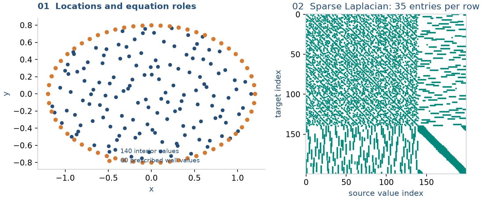

# Assemble your own PDE from RBF operators

**Goal:** use RBFLAB for differentiation while owning equation assembly and the
sparse solve. Read [one stencil](one-stencil.md) and [symbolic PDEs](symbolic-pde.md) first.

## 1. Choose the mathematical expression

Consider a non-divergence-form equation:

$$-\kappa(x,y)\Delta u+b_xu_x+b_yu_y+\alpha u=f,\qquad u|_\Gamma=g,$$

where $\kappa=1+0.2x$, $b_x=0.4$, $b_y=-0.2$, and $\alpha=1$.
We will write every matrix operation explicitly.

```python
import numpy as np
import scipy.sparse as sparse
from scipy.sparse.linalg import spsolve
import sympy as sp
import rbflab as rbf
from rbflab import geometry, meshgen
```

```python
--8<-- "examples/tutorials/custom_assembly.py:cloud"
```

`I` and `B` select interior and boundary rows of `X`. Every full matrix below
uses the original cloud ordering.



This is the actual 200-node cloud and 35-node stencil recipe in the script.
The sparsity plot identifies which source values contribute at each target.

## 2. Construct reusable differential maps

```python
local = rbf.PythonBackend(compute_condition=False)
```

```python
--8<-- "examples/tutorials/custom_assembly.py:operators"
```

Targets default to source nodes, so all three matrices have shape $(N,N)$.
Their rows approximate $u_x$, $u_y$, and $\Delta u$. The recipe uses PHS5 and cubic
polynomials. [Local scaling](../theory/conditioning.md#local-stencil-scaling)
normalizes kernel distances while preserving physical derivative units.
`compute_condition=False` skips an optional diagnostic, not part of the equation.

## 3. Translate the equation into sparse algebra

For nodal samples $U$,

$$A_h=-\operatorname{diag}(\kappa(X))L+b_xD_x+b_yD_y+\alpha I_N.$$

```python
--8<-- "examples/tutorials/custom_assembly.py:combine"
```

Left multiplication by the diagonal samples $\kappa$ at the target of each row.
This is $-\kappa\Delta u$, not $-\nabla\cdot(\kappa\nabla u)$. The latter also
contains $-\nabla\kappa\cdot\nabla u$ by the product rule. Keep the continuous
equation clear when combining matrices.

Boundary rows of `A` still represent the differential expression. Next we apply
the boundary condition separately.

## 4. Supply the data and eliminate prescribed values

For $u=\sin x\cos y$, take
$f=(2\kappa+\alpha)u+b_x\cos x\cos y-b_y\sin x\sin y$ and $g=u|_\Gamma$.

```python
--8<-- "examples/tutorials/custom_assembly.py:data"
```

The interior equations split into

$$A_{II}U_I+A_{IB}g_B=f_I,\qquad A_{II}U_I=f_I-A_{IB}g_B.$$

```python
--8<-- "examples/tutorials/custom_assembly.py:solve"
```

`U` contains nodal values in cloud order, not expansion coefficients. This is
your SciPy solve: you can replace its solver, reuse a factorization, or embed it
in a larger algorithm. Neumann/Robin conditions do not prescribe $U_B$ directly;
assemble boundary-functional rows instead of reusing this elimination unchanged.

## 5. Inspect the local construction

```python
--8<-- "examples/tutorials/custom_assembly.py:inspect"
```

`local_row` contains copies of indices, weights and polynomial multipliers.
`local_system` reconstructs the augmented local weight equation on demand.
Editing these inspection outputs does not update the operator.

The `.matrix` attribute exposes SciPy storage. Copy it before experimenting if
other code needs the original operator. Changing that matrix does not update
cached local inspection records.

For custom neighborhoods, choose indices and call
`method.weights(centers=selected_points, target=target, operator=operator)`,
then scatter the weights into your own sparse matrix. There is currently no
generic public callback to replace every method's local ansatz or solver; use
this explicit construction when the existing method settings do not express your idea.

## 6. Express the same problem symbolically

```python
--8<-- "examples/tutorials/custom_assembly.py:symbolic"
```

This reuses the same cloud and method. The symbolic route applies the same PDE
and boundary equations, although its boundary unknowns need not be eliminated
in the same algebraic form. A quick check compares `U` with `symbolic.evaluate(X)`.

## Where to put your own idea

| Change | Relevant construction |
|---|---|
| New radial family | Kernel supplied before constructing `ops` |
| New differential expression | Requested operators and matrix combination |
| New boundary model | Boundary rows or elimination |
| New solver/preconditioner | The `spsolve` call |
| New time integrator | A loop around the spatial matrices |
| New neighbor rule | Explicit points supplied to `method.weights` |

New values on fixed nodes can reuse fixed weights. Changing nodes, kernel or
stencil settings requires rebuilding. With [backend setup](../INSTALL.md), the
script accepts `--backend cpp` or `--backend torch` for local assembly. The global
solve here remains SciPy Float64.

## Complete example

Run `python -m examples.tutorials.custom_assembly` from a source checkout.

??? example "Complete runnable script"

    ```python
    --8<-- "examples/tutorials/custom_assembly.py"
    ```

[Download the script](https://raw.githubusercontent.com/LDBreton/RBFLAB/main/examples/tutorials/custom_assembly.py).

**Next:** [Time-step these kinds of matrices](heat-equation.md), then [build a coupled cavity algorithm](cavity.md).
