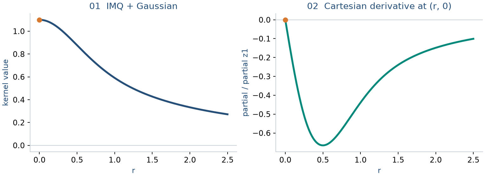

# Define and use a custom kernel

**Goal:** express a radial family mathematically, obtain Cartesian derivatives,
and use the same kernel in interpolation and local operators. Familiarity with
[interpolation](interpolation.md) and basic SymPy is sufficient.

## 1. Write the family using squared radius

RBFLAB's symbolic radial variable is $s=\|x-y\|^2$, not $r=\|x-y\|$.
For example, $\phi(r;c)=(1+cr^2)^{-1/2}$ becomes $(1+cs)^{-1/2}$.

```python
import numpy as np
import sympy as sp
import rbflab as rbf
```

```python
--8<-- "examples/tutorials/custom_kernel.py:family"
```

`imq_family` describes an expression with an unbound parameter. Calling it with
`c="2"` returns a kernel with that parameter fixed for evaluation. The string
preserves the decimal representation for precision-aware paths; it does not
turn on extended precision. A float also works for ordinary Float64 use.
The positive assumption rejects nonpositive parameter bindings.

## 2. Request Cartesian derivatives

Let $z=x-y$. The derivative argument is an array of **displacement vectors**,
not squared distances. A multi-index specifies differentiation with respect to $z$:

```python
--8<-- "examples/tutorials/custom_kernel.py:derivatives"
```

`(0, 0)` requests the value, `(1, 0)` requests $\partial_{z_1}$, and `(2, 0)`
requests $\partial_{z_1}^2$. Each result has shape `(2,)` here. For this IMQ,

$$\phi(0)=1,\qquad \partial_{z_1}\phi(0)=0,\qquad
\partial_{z_1}^2\phi(0)=-c.$$

These are Cartesian limits, not a radial derivative substituted for a Cartesian
one. RBFLAB uses a validated origin expansion at coincident points. Comparing
with `IMQ(2)` establishes the meaning of the interface before defining a new family.
Source-side differentiation of $K(x,y)$ includes the sign from $z=x-y$;
`kernel.matrix(X, Y, left=..., right=...)` handles that convention.

## 3. Define a different family

Combine IMQ and Gaussian components:

$$\phi(r;c,\beta)=(1+cr^2)^{-1/2}+\beta e^{-cr^2},\qquad c>0,\ \beta\geq0.$$

```python
--8<-- "examples/tutorials/custom_kernel.py:mixture"
```

`another_kernel` changes parameters without changing the symbolic structure.
This sum illustrates how to express an idea; it is not a claim that the mixture
outperforms either constituent.



The figure uses `c=2`, `beta=0.1`, and displacements $(r,0)$. It shows the actual
family defined above; the derivative vanishes at the origin.

## 4. Use it like a built-in kernel

```python
--8<-- "examples/tutorials/custom_kernel.py:interpolation"
```

The interpolation API is unchanged. Quadratic polynomials are explicitly included
in this example, although this family does not declare them as mandatory.

For a derivative map, select a local backend and the operators:

```python
local = rbf.PythonBackend(compute_condition=False)
```

```python
--8<-- "examples/tutorials/custom_kernel.py:operators"
```

The bound kernel belongs to `ScalarSpace`. `Samples` supplies the values,
and `LocalApproximation` builds maps for the requested derivatives. Replacing
the kernel therefore leaves the source/target contract unchanged.

`kernel_dx` in step 2 differentiates the **kernel**; `field_dx` differentiates the
**sampled field through RBF-FD weights**. Changing the kernel does not change the
meaning of `Laplacian()` or the data arrays.

## 5. Understand the regularity requirements

A standard scalar RBF-FD Laplacian needs second kernel derivatives. A symmetric
second-order collocation or LHI system can need fourth derivatives because
operators act on both arguments. Divergence-free constructions add derivatives
when constructing the matrix-valued kernel. The symbolic evaluator currently
supports Cartesian derivatives through total order six.

A supplied expression is not automatically an admissible interpolation kernel:
positive/conditional positive definiteness and the required polynomial space
remain mathematical choices. Set `minimum_degree` when defining a family that
requires augmentation; this declaration is supplied by the author, not inferred.
Unsupported expressions or insufficient origin/support smoothness raise errors.
Validated compact-support branches and built-in `Wendland` kernels are described
in the [kernel reference](../api/kernels-geometry.md).

## 6. Optional native preparation and caching

After the [C++ source setup](../INSTALL.md), a family can be prepared explicitly:

```python
--8<-- "examples/tutorials/custom_kernel.py:compile"
```

Run the complete script with `--compile` to exercise this path and check cache reuse.
The artifact describes the expression and requested derivatives; parameters remain
runtime inputs. Repeating an equivalent request can reuse the validated disk cache.
Python also caches symbolic derivative expressions in process. The first use may
therefore do more work than later evaluations. Request the order your construction
actually needs; compiling order two is not sufficient for every Hermite method.

To accelerate the local **weight solves** as well, the complete script accepts
`--backend cpp` or `--backend torch`. Those backends prepare their supported local
operator path as needed. Compilation of a kernel alone does not move an entire
global solve into C++. See [capabilities](../CAPABILITIES.md).

### A quick check

The script compares the custom IMQ second derivative with the built-in one,
including at zero. For your own family, start with one derivative whose formula
you can check by hand.

## Complete example

Run `python -m examples.tutorials.custom_kernel` from a [source checkout](../INSTALL.md).
The short API fragments above also work with an installed package when combined
with their imports and preceding steps.

??? example "Complete runnable script"

    ```python
    --8<-- "examples/tutorials/custom_kernel.py"
    ```

[Download the script](https://raw.githubusercontent.com/LDBreton/RBFLAB/main/examples/tutorials/custom_kernel.py).

**Next:** [Write a symbolic PDE](symbolic-pde.md) or [assemble your own matrix](custom-assembly.md).
