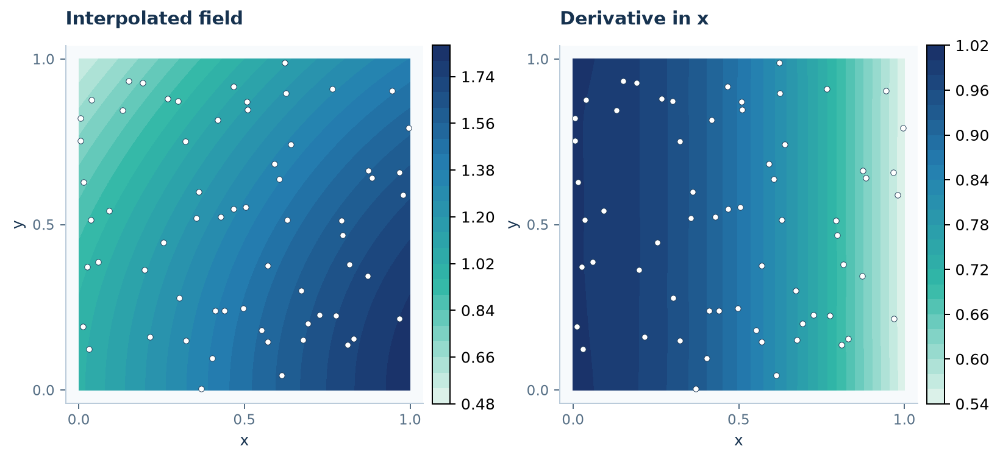

# Differentiate a field

**Goal:** compute gradients and Laplacians, then reuse local derivative matrices
with new data. Start with [scattered-data interpolation](interpolation.md).

## 1. Construct a function from samples

```python
import numpy as np
import rbflab as rbf
```

```python
--8<-- "examples/tutorials/differentiation.py:data"
```

`interpolant` is the global function $s$ fitted to these 64 values. `query`
contains three evaluation points. We will differentiate that function, not
finite-difference the three query values.

## 2. Apply a differential functional

For $s(x)=\sum_j a_j\phi(\|x-x_j\|)+\sum_m b_mp_m(x)$,

$$\partial_x s(x)=\sum_j a_j\partial_x\phi(\|x-x_j\|)
+\sum_m b_m\partial_xp_m(x).$$

The fitted coefficients stay fixed; the evaluation basis is differentiated.

```python
--8<-- "examples/tutorials/differentiation.py:derivatives"
```

Axis 0 means $x$, axis 1 means $y$. Each `evaluate(query, operator)` returns
one scalar per query. Stacking the two first derivatives gives an `(M, 2)`
gradient; the Laplacian is an `(M,)` array. In 3D, use `dimension=3`, include
axis 2, and use `Laplacian(3)`.

A second derivative can be expressed as `dx @ dx`: here `@` **composes differential
operators**. Later, `ops.dx @ values` is **matrix application**. The objects on
its two sides determine its meaning.



## 3. Build matrices when the sampled data will change

Suppose you need the same derivatives of many fields on the same source nodes.
Construct RBF-FD weights once:

$$D_x d\approx (\partial_x u(q_k))_{k=1}^M,\qquad D_x\in\mathbb R^{M\times N}.$$

```python
--8<-- "examples/tutorials/differentiation.py:maps"
```

`Samples(centers, size=20)` declares value data and the per-target neighbor count.
`space.representers(source)` forms ordinary kernel translates because these
source functionals are point evaluations. `targets` gives locations where
derivatives are requested. With one source block, `ops.dx @ values` and
`ops.dx["u"] @ values` are equivalent. Here each matrix has shape `(3, 64)`.
Every target uses 20 neighboring samples and quadratic polynomial augmentation.
The names `dx`, `dy`, and `lap` are keys you choose; attribute and dictionary
access refer to the same operators.

The global interpolant and these local maps are **different approximations**.
One uses all 64 samples in a single fit; the other fits a neighborhood for each
target. Their derivatives need not agree exactly.

## 4. Reuse and combine the operators

```python
new_values = centers[:, 0]**2 + centers[:, 1]**2
new_laplacian = ops.lap @ new_values
A = 2*ops.dx.matrix - ops.dy.matrix
advective_derivative = A @ new_values
```

`A` is an ordinary SciPy sparse matrix for $2\partial_x-\partial_y$ at these
three targets. Changing only the sampled data does not require rebuilding the
weights. Changing source/target locations, kernel, or stencil policy does.

### A quick check

For $x^2+y^2$, the Laplacian is 4. This local map's maximum error on that
check is about $3.02\times10^{-13}$. On the separate smooth-field query,
the maximum gradient errors are about $1.46\times10^{-4}$ for the global
interpolant and $6.00\times10^{-4}$ for the local map. These compare
approximations with different source sets, not universal accuracy.

## Complete example

Run `python -m examples.tutorials.differentiation` from a [source checkout](../INSTALL.md).
The short API fragments above also work with an installed package when combined
with their imports and preceding steps.

??? example "Complete runnable script"

    ```python
    --8<-- "examples/tutorials/differentiation.py"
    ```

[Download the script](https://raw.githubusercontent.com/LDBreton/RBFLAB/main/examples/tutorials/differentiation.py).

**Next:** [Build local operators](local-approximation.md), or inspect
[one stencil](one-stencil.md).
