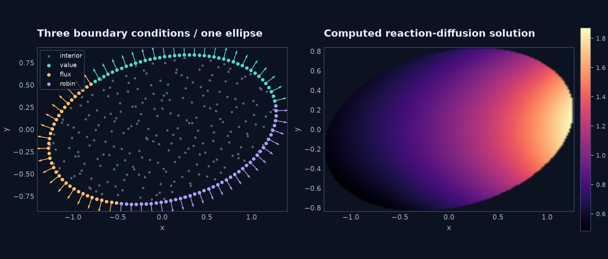

# Mixed conditions on an ellipse

Use three labeled parameter arcs on a rotated ellipse to impose different
linear boundary operators:

$$
-\Delta u+u=f,\qquad u_{\rm exact}=e^{x/2}\cos y,
$$

$$
B_1u=u,\qquad B_2u=\boldsymbol n\cdot\nabla u,\qquad
B_3u=u+\boldsymbol n\cdot\nabla u.
$$

The right-hand sides are the corresponding operators applied to the exact field.
The normals come from the geometry, so the same symbolic normal derivative works
on the curved domain.

```python
domain = geometry.Ellipse(labels=("value", "flux", "robin"), angle=.25)
cloud = meshgen.generate(domain, interior=240, boundary=120, seed=42)
dn = model.normal_derivative(u)
robin = u + dn
boundary = [
    model.bc("value", sp.Eq(u, exact)),
    model.bc("flux", sp.Eq(dn, dn.subs(u, exact).doit())),
    model.bc("robin", sp.Eq(robin, robin.subs(u, exact).doit())),
]
```



```sh
python -m examples.ellipse_boundary --backend cpp
python -m examples.ellipse_boundary --backend torch
```

The default 360-node calculation uses PHS5, degree-three polynomials, 35-node
RBF-FD stencils, [local scaling](../theory/conditioning.md#local-stencil-scaling) (kernel distances divided by the stencil radius) and Float64. Its independent sampled maximum error
is approximately $2.7\times10^{-4}$. Arc junctions are assigned to the arc that
starts there; no duplicate boundary rows are introduced.

??? example "Complete runnable source"

    ```python
    --8<-- "examples/ellipse_boundary.py"
    ```

**Try next:** change the Robin coefficient or ellipse rotation while retaining the
same symbolic construction of the right-hand sides.
