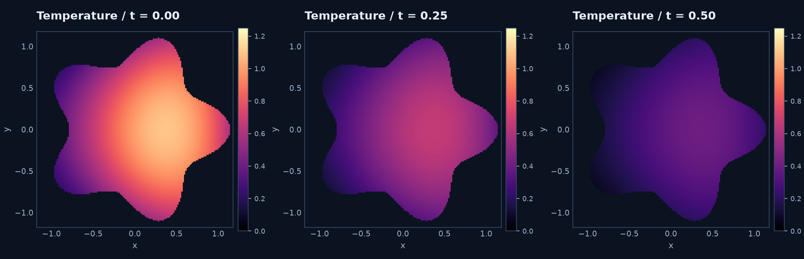
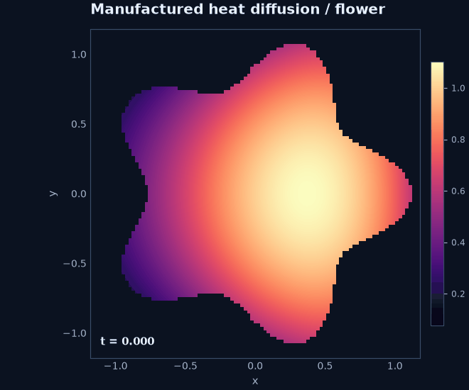

# Heat diffusion on a flower

A smooth five-petal domain illustrates time-dependent boundary values and symbolic
forcing. Its boundary is $r(\theta)=1+0.18\cos(5\theta)$.

$$
u_t-0.15\Delta u=f,\qquad
u_{\rm exact}(x,y,t)=e^{-2t}\left(\cos x\cos y+\tfrac14\sin(2x)\right).
$$

Substitute the exact expression into the left-hand side to manufacture $f$.
Use its trace as Dirichlet boundary data and its value at $t=0$ as initial data.
This is a **forced verification problem**, with nonzero boundary temperature.

```python
model = rbf.SymbolicScalar(2, transient=True)
u, t = model.field, model.time
x, y = model.coordinates
exact = sp.exp(-2*t)*(sp.cos(x)*sp.cos(y) + sp.sin(2*x)/4)
lhs = sp.diff(u, t) - sp.Rational(15, 100)*model.laplacian(u)
problem = model.evolution(
    sp.Eq(lhs, lhs.subs(u, exact).doit()), initial=exact.subs(t, 0),
    boundary=[model.bc("boundary", sp.Eq(u, exact))],
)
```



## Run and animate

```sh
python -m examples.heat_flower --backend cpp --animation flower.gif
# Or: --backend python / --backend torch
```

The default uses 250 Halton interior and 120 arc-length boundary nodes, seed 42,
PHS5 plus degree-three polynomials, 35-node RBF-FD stencils, local scaling and Float64.
Backward Euler starts BDF2; $\Delta t=0.025$, 20 steps, final time $0.5$.
The final independent sampled error is about $1.1\times10^{-3}$, including spatial
and time errors. Vary time step separately when studying temporal convergence.



The animation calls `viz.animate_scalar(trajectory, "flower.gif", domain=domain)`.
Only physical display points are evaluated; color limits remain fixed across frames.
The display grid is independent of the numerical cloud.

For the matrix derivation, including time-dependent boundary contributions, follow
[heat equation from matrices](heat-equation.md).

??? example "Complete runnable source"

    ```python
    --8<-- "examples/heat_flower.py"
    ```

**Try next:** change the exact field, regenerate the forcing symbolically, and
compare the final nodal and off-node errors before increasing the node count.
