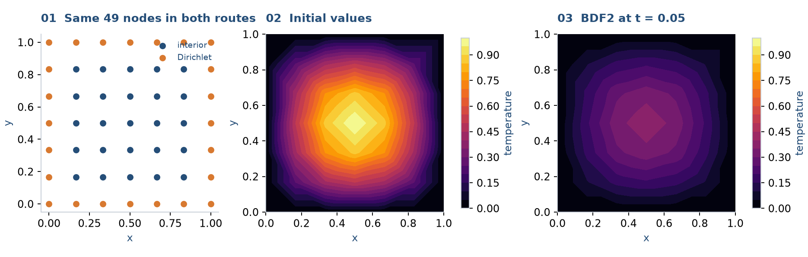

# Time-step the heat equation

**Goal:** express heat diffusion with the symbolic API, then build exactly the
same update from an RBF-FD Laplacian and ordinary SciPy algebra. Read
[custom matrix assembly](custom-assembly.md) first if sparse slicing is new.

## 1. Fix one mathematical problem and one recipe

On $(0,1)^2$, solve

$$u_t=\kappa\Delta u,\qquad u|_{\partial\Omega}=0,\qquad
u(x,y,0)=\sin(\pi x)\sin(\pi y).$$

```python
import numpy as np
import sympy as sp
import scipy.sparse as sparse
from scipy.sparse.linalg import splu
import rbflab as rbf
```

```python
--8<-- "examples/tutorials/heat_equation.py:settings"
```

Both routes below use these exact objects: 49 nodes, PHS5, quadratic polynomials,
20-node stencils, Float64, and default physical kernel scaling. Five steps reach
$t=0.05$. The point grid supplies locations; all spatial weights are RBF-FD.



## 2. Declare an evolution problem

```python
--8<-- "examples/tutorials/heat_equation.py:symbolic"
```

`transient=True` adds the time symbol. `initial` gives the field at $t=0$;
boundary equations supply values at subsequent times. `scheme="bdf2"` requests
BDF2 with a backward-Euler startup. The returned trajectory stores computed
states; `.final` supplies the final field reconstruction.

## 3. Construct the same spatial operator explicitly

```python
--8<-- "examples/tutorials/heat_equation.py:operators"
```

`ops.lap @ U` approximates $\Delta u$ at all nodes. Interior equations separate
unknown interior values from prescribed boundary values:

$$\dot U_I=\kappa L_{II}U_I+\kappa L_{IB}g_B(t)+f_I(t).$$

`lap_ii` is $25\times25$, while `lap_ib` maps 24 boundary values into those 25
interior equations. The present problem has $g=f=0$; keeping the terms visible
shows where nonzero data enter. You can also inspect `ops.lap.local(i)` and
`ops.lap.reconstruct_local(i)` as in [one stencil](one-stencil.md).

## 4. Translate the time formula into factors

Let $q^{n+1}=\kappa L_{IB}g_B^{n+1}+f_I^{n+1}$. The first step is

$$(I-\Delta t\,\kappa L_{II})U_I^1=U_I^0+\Delta t\,q^1.$$

Subsequent BDF2 steps satisfy

$$(\tfrac32I-\Delta t\,\kappa L_{II})U_I^{n+1}
=2U_I^n-\tfrac12U_I^{n-1}+\Delta t\,q^{n+1}.$$

Prepare the two fixed matrices once:

```python
--8<-- "examples/tutorials/heat_equation.py:factors"
```

The RBF construction determines $L$. Backward Euler and BDF2 determine the time
formula. They are separate choices, which is why another time integrator can
reuse these spatial operators.

## 5. Advance and restore the full field

```python
--8<-- "examples/tutorials/heat_equation.py:loop"
```

At each step, the code supplies boundary data and forcing, solves for interior
values, then fills the full vector in original cloud order. `states` has shape
`(steps+1, 49)`, including the initial condition. No RBF coefficient solve occurs
inside this loop: the spatial weights were assembled beforehand.

## Modify the problem

- Replace `g` and `f` with arrays evaluated at the current `time` for nonzero data.
  Make the corresponding change in the symbolic declaration.
- Change the initial expression and `initial_values` together.
- Replace the update formula to experiment with time integration.
- If `dt`, $\kappa$, or $L$ changes, rebuild the affected factors.
- Change geometry while preserving boundary groups; see [heat on a flower](flower-heat.md).

For an extended implementation with selectable time schemes and nonzero-data
examples, `examples/tutorials/heat_matrices.py` provides `rbf_fd_laplacian`,
`march`, and `symbolic_solution`. The compact script here keeps one case visible.

### A quick check

The full script compares the two final nodal arrays. Their agreement checks the
translation between API routes, not independent spatial accuracy. The continuous
solution is $e^{-2\kappa\pi^2t}\sin(\pi x)\sin(\pi y)$ if you want a separate check.

## Complete example

Run `python -m examples.tutorials.heat_equation` from a source checkout.

??? example "Complete runnable script"

    ```python
    --8<-- "examples/tutorials/heat_equation.py"
    ```

[Download the script](https://raw.githubusercontent.com/LDBreton/RBFLAB/main/examples/tutorials/heat_equation.py).

**Next:** [Heat on a curved domain](flower-heat.md), or [coupled Stokes fields](annular-stokes.md).
