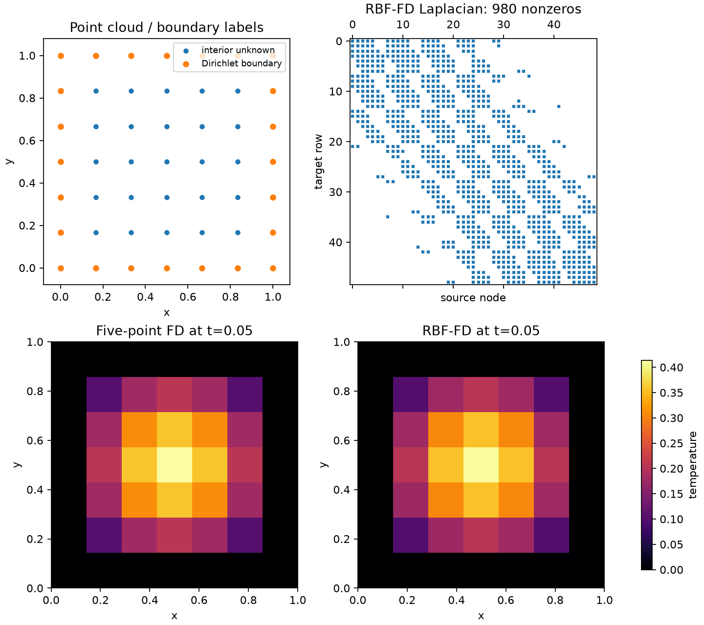
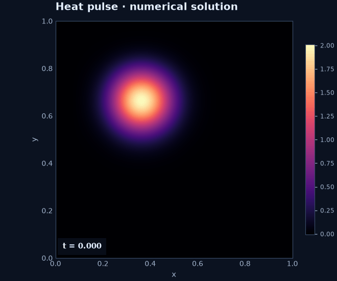

# Heat equation from matrices

<figure class="method-detail"><figcaption>RBF-FD temperature at t = 0.02, computed on 361 nodes with PHS5, degree-two polynomials, 25-node stencils, and BE-started BDF2. The surface uses cubic display interpolation of computed nodal temperatures; the contours show the same field.</figcaption></figure>

**You will learn:** to assemble a Laplacian, eliminate Dirichlet values, reuse a sparse factorization, and compare five-point FD, RBF-FD, and RBFLAB's symbolic interface. Prerequisites: sparse matrices and the [single-stencil tutorial](one-stencil.md).

## PDE, cloud, and unknowns

On \(\Omega=(0,1)^2\), solve

$$
u_t=\kappa\Delta u+f,\qquad u|_{\partial\Omega}=g(t),\qquad u(x,0)=u_0(x).
$$

The main example uses \(\kappa=1\), \(f=g=0\), and
\(u=e^{-2\pi^2t}\sin(\pi x)\sin(\pi y)\). `unit_box_grid(cells)` produces \(N=(\mathrm{cells}+1)^2\) nodes ordered with `indexing="ij"`: node \((i,j)\) has flat index \(i(\mathrm{cells}+1)+j\). `cloud.interior_indices` identifies unknown temperatures; `cloud.boundary_indices` identifies prescribed values.

## Three spatial implementations

The classical five-point formula is

$$
(\Delta_hu)_{i,j}=
\frac{u_{i-1,j}+u_{i+1,j}+u_{i,j-1}+u_{i,j+1}-4u_{i,j}}{h^2}.
$$

`five_point_laplacian` writes its coefficients into a full \(N\times N\) sparse matrix. Boundary rows are zero because the march uses only interior rows. For RBF-FD, `RBFFD(...).operators(...).lap.matrix` also builds a full \(N\times N\) Laplacian, using PHS5, degree-two polynomials, and 20-node stencils. The symbolic route declares \(u_t-\kappa\Delta u=f\) and lets RBFLAB assemble the same RBF-FD operators.

## Boundary elimination and time stepping

Partition the full nodal vector into interior \(\boldsymbol u_I\) and known boundary values \(\boldsymbol g_B\). Slicing either Laplacian \(L\) gives

$$
\dot{\boldsymbol u}_I
=\kappa L_{II}\boldsymbol u_I+\kappa L_{IB}\boldsymbol g_B(t)+\boldsymbol f_I(t).
$$

The code uses `lap_ii = matrix[interior, :][:, interior]` and `lap_ib = matrix[interior, :][:, boundary]`. For backward Euler,

$$
(I-\Delta t\,\kappa L_{II})\boldsymbol u_I^{n+1}
=\boldsymbol u_I^n+\Delta t\bigl(\kappa L_{IB}\boldsymbol g_B^{n+1}
+\boldsymbol f_I^{n+1}\bigr).
$$

`splu` factors the fixed left matrix once. At each step the code updates \(g\) and \(f\), solves for the interior vector, then inserts it with the boundary values into a full nodal array for plotting.

With one backward Euler startup step, BDF2 instead uses

$$
\left(\tfrac32 I-\Delta t\,\kappa L_{II}\right)\boldsymbol u_I^{n+1}
=2\boldsymbol u_I^n-\tfrac12\boldsymbol u_I^{n-1}
+\Delta t\bigl(\kappa L_{IB}\boldsymbol g_B^{n+1}
+\boldsymbol f_I^{n+1}\bigr).
$$

This needs one factorization for startup and one for subsequent steps. The built-in scalar integrator supports backward Euler and BDF2; Crank–Nicolson is an optional direct-matrix exercise, not a built-in scheme.

## Run, visualize, and assess

From a source checkout, install `rbflab[examples]` when plotting, then run:

```sh
python -m examples.tutorials.heat_matrices
python -m examples.tutorials.heat_matrices --scheme bdf2 --nonzero-boundary
python -m examples.tutorials.heat_matrices --study
python -m examples.tutorials.heat_matrices --plot outputs/heat_tutorial.gif
python -m examples.tutorials.heat_matrices --figure outputs/heat_matrices.png
```

??? example "Complete runnable script"

    ```python
    --8<-- "examples/tutorials/heat_matrices.py"
    ```

[Download the runnable script](https://raw.githubusercontent.com/LDBreton/RBFLAB/main/examples/tutorials/heat_matrices.py).

The default run has 49 nodes (25 interior), \(\Delta t=0.01\), and five steps. Final **nodal maximum** errors were \(0.04123\) for five-point FD and \(0.03767\) for both explicit-matrix and symbolic RBF-FD. Agreement of the latter two checks assembly; their common error mixes space and time effects.

### Reproduce the measured case

The recorded run used Python 3.12.14, NumPy 2.5.3, SciPy 1.18.1,
RBFLAB 0.1.0 source, and Float64 arithmetic. The cloud was
unit_box_grid(6) on the unit square; both RBF-FD routes used signed
PHS5, degree-two polynomials, 20-node stencils, and the Python local
backend. The five-point FD route used the same 49 nodes. Dirichlet
values were eliminated through the interior/boundary matrix blocks.

| Check | Resolution | Nodal maximum error |
|---|---:|---:|
| Semidiscrete RBF-FD versus exact at \(t=0.05\) | 25 / 49 / 81 nodes | \(5.7173/4.3519/3.5978\) × \(10^{-3}\) |
| Backward Euler versus fixed 81-node semidiscrete solution | \(\Delta t=0.025/0.0125/0.00625\) | \(7.5005/4.0859/2.1412\) × \(10^{-2}\) |

The spatial row evolves the discrete system with a matrix exponential,
removing time-stepping error. The temporal row fixes the cloud and
compares against that same discrete system. It shows first-order time
behavior over these three steps; the spatial errors decrease more slowly
and do not establish an asymptotic convergence rate.

The second run uses \(u=e^{-t}(1+x+y)\), \(f=-u\), and \(g=u|_{\partial\Omega}\). Its BDF2 errors were near \(10^{-4}\) for both spatial matrices, exercising the \(L_{IB}g\) term. `--study` compares semidiscrete evolution using `expm_multiply` with the continuous exact solution at several clouds, then holds a cloud fixed to isolate backward Euler time error against the semidiscrete solution. An implicit time step avoids a forward-Euler restriction for a stable diffusion matrix; it cannot repair growing modes in an unstable spatial operator.



The upper-left panel labels interior unknowns and Dirichlet boundary nodes. The upper-right panel shows the nonzero pattern of the full RBF-FD Laplacian; only its interior rows enter the time step. The lower panels use the same temperature scale at \(t=0.05\). The figure is regenerated with `--figure docs/assets/heat_matrices.png` from a source checkout.



Try halving \(\Delta t\) on a fixed cloud; only the time contribution should shrink until spatial error dominates. See [time discretization](../theory/time-discretization.md), [error measures](../theory/errors.md), and the [discretization API](../api/discretizations.md).
