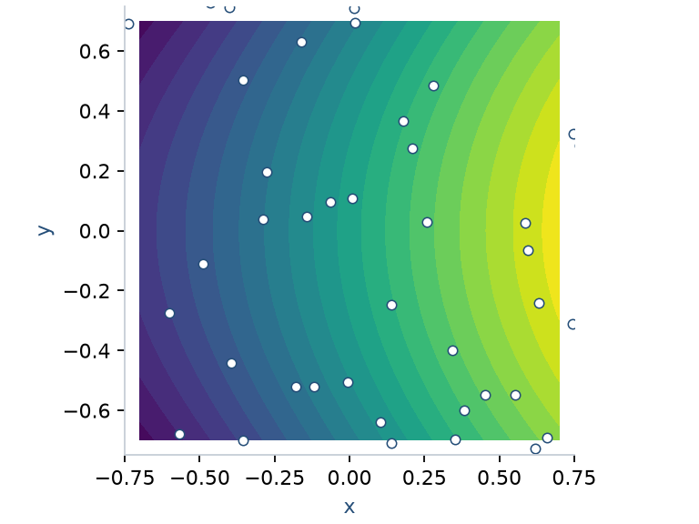
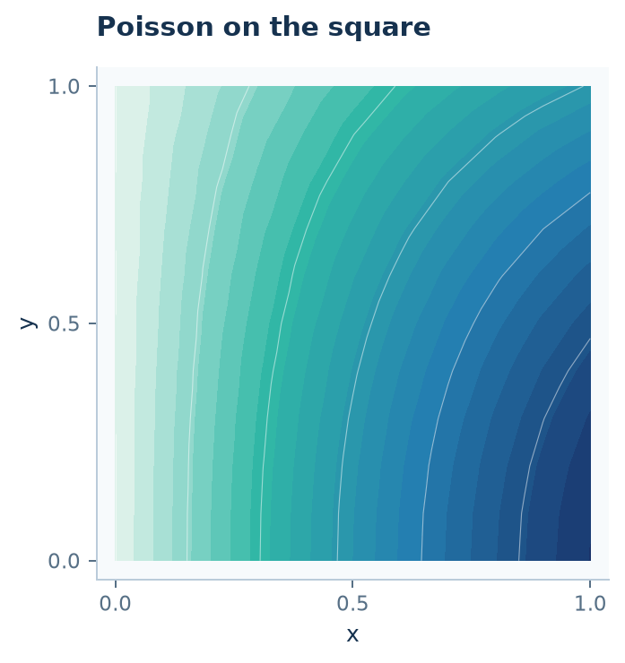
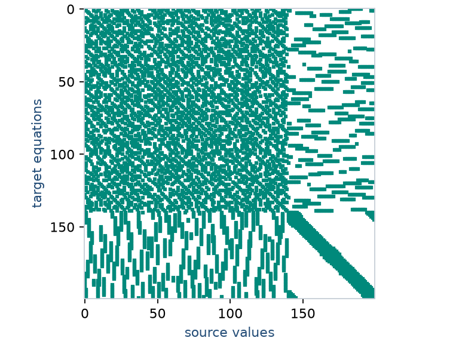

# From mathematical ideas to working code

Use RBFLAB to interpolate your data, express a PDE, or construct a numerical
method from local weights and sparse operators. These lessons assume some
familiarity with RBFs and explain how the mathematics maps to Python objects.
They can be followed independently or used as a sequence for teaching.

## Choose what you want to build

<article class="rbf-example">
<h3><a href="interpolation/">A field from data</a></h3>
Supply arrays, choose a kernel, evaluate and differentiate.

</article>
<article class="rbf-example">
<h3><a href="symbolic-pde/">A PDE from equations</a></h3>
Connect geometry, symbolic fields, boundary equations and approximation.

</article>
<article class="rbf-example">
<h3><a href="custom-assembly/">Your own algorithm</a></h3>
Inspect weights, combine sparse maps, and control the solve.

</article>

Start with [installation](../INSTALL.md), or [your first RBF problem](../getting-started.md)
for a compact introduction. To construct domains without solving a PDE, use
[mesh generation](../geometry/index.md).

## Path A — Interpolate and differentiate

| Lesson | Mathematical construction | What you can change afterward |
|---|---|---|
| [Interpolate scattered data](interpolation.md) | Values become an RBF expansion | Your samples, kernel, query locations |
| [Differentiate a field](differentiation.md) | Functionals act on an interpolant or local maps | Derivative, source/target points, sampled field |
| [Define a custom kernel](custom-kernel.md) | A symbolic radial family becomes an evaluable kernel | Formula, parameters, requested derivatives |

No PDE is required for this path. Array shapes and the distinction between
coefficients, values, and derivative weights are introduced as they are used.

## Path B — Solve a PDE

| Lesson | Mathematical construction | What you can change afterward |
|---|---|---|
| [Write a symbolic PDE](symbolic-pde.md) | Equation and boundary expressions become a problem | Differential expression and boundary model |
| [Global collocation](global-collocation.md) | Trial expansion becomes dense PDE rows | Ordinary or source-functional trial basis |
| [Functionals to operators](local-approximation.md) | Space, sampled data and trial become named sparse maps | Trial construction, source groups, target operators |
| [LHI and heat from matrices](lhi-matrices.md) | Hermite maps become stiffness, mass and forcing blocks | Center layout, equations, time integrator |
| [One RBF-FD stencil](one-stencil.md) | Local interpolation becomes derivative weights | Space, target functional, chosen neighbors |
| [Local Hermite interpolation](lhi.md) | Values and PDE/boundary data become a local identity | Local center roles and PDE-center count |
| [Heat time stepping](heat-equation.md) | A spatial matrix becomes an evolution equation | Initial data, boundary values, time formula |
| [Coupled Stokes fields](annular-stokes.md) | Velocity/pressure spaces become a coupled problem | Body force, walls, and approximation spaces |

The global and LHI lessons use the same small Poisson problem to make their
constructions easy to follow. [Compare the methods](global-lhi.md) afterward.

## Path C — Implement your own ideas

Start with [functionals to sparse operators](local-approximation.md), then
[LHI and heat from matrices](lhi-matrices.md). These are the canonical local
research interfaces. [One stencil](one-stencil.md) and
[assemble your own PDE](custom-assembly.md) also explain the retained RBF-FD
convenience interface.
This path shows where ordinary NumPy/SciPy code takes over: combining derivative
maps, eliminating prescribed values, solving matrices and writing update loops.
Continue with [heat](heat-equation.md) before the advanced [cavity algorithm](cavity.md).
The cavity is an explained experimental flow construction, not a validated
benchmark or a general Navier–Stokes solver.

## Apply the ideas on other domains

- [Poisson with holes](perforated-poisson.md): label an obstacle boundary and solve.
- [Mixed boundaries on an ellipse](ellipse.md): assign Dirichlet, Neumann and Robin equations to arcs.
- [Heat on a flower](flower-heat.md): nonzero transient boundary data on a curved domain.
- [Poisson inside a 3D ball](ball.md): move geometry and operators into three dimensions.

Each application supplies a domain/node image. The same API concepts carry over;
you do not need a separate numerical method for each shape.

## Use a lesson in your project or classroom

Every main lesson introduces the mathematics, constructs the code in visible
steps, explains the resulting objects, and suggests specific modifications.
Full scripts are available at the end. The [teaching guide](teaching.md) gives
short lesson sequences and exercises for students.

Short fragments use an installed `rbflab` package. `python -m examples...` runs
from a source checkout; examples are not an installed Python subpackage.
Plotting requires `rbflab[examples]`. Python is the default; C++ and PyTorch are
optional for supported local paths, with setup and limitations in
[installation](../INSTALL.md) and [capabilities](../CAPABILITIES.md).

Each lesson includes a short check where useful. Detailed error, conditioning,
and refinement discussions remain in [mathematical foundations](../theory/index.md)
and the [validation guide](../guides/curved-validation.md).
