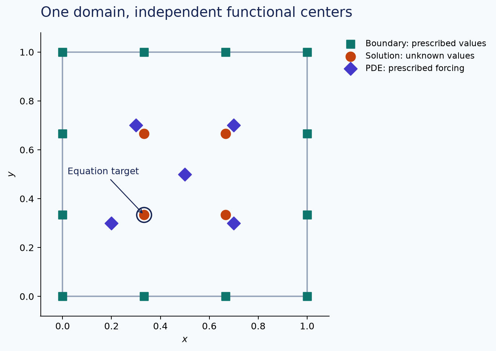

# Choose LHI functional centers

An LHI patch combines unknown solution values, prescribed boundary data and
prescribed PDE data. These functionals need not share one point cloud:

$$d_i=(u(X_{S,i}),\;g(X_{B,i}),\;f(X_{F,i})).$$

A local Hermite approximation gives

$$\mathcal L u(x_i)\approx w_{S,i}^T u(X_{S,i})
+w_{B,i}^Tg(X_{B,i})+w_{F,i}^Tf(X_{F,i}).$$

Only the solution weights become columns of the global unknown vector:

$$w_{S,i}^T U=f(x_i)-w_{B,i}^Tg(X_{B,i})-w_{F,i}^Tf(X_{F,i}).$$



## Express the groups

This complete example reproduces $u=1+x^2+y^2$. The PDE centers are independent
of the solution grid; changing them does not introduce extra global unknowns.

```python
--8<-- "examples/tutorials/lhi_centers.py"
```

`cloud.interior` defines the global solution DOFs and equation targets.
Solution groups select from those DOFs. Boundary and PDE groups may contain
independent coordinates. `problem.boundary` still describes the domain's boundary
conditions; explicit boundary groups supply the functionals actually used in
patches. They can sample the same conditions at other points.

## Selection and operators

- `size=n` chooses n eligible nearest centers in that group.
- `size=None` includes the whole group.
- `indices=[...]` supplies one row of group-local indices per interior target,
  preserving its order. It is exclusive with size and selection policy.
- `target="exclude"` excludes exact coordinate matches from that group.
- `target="require"` verifies that the target is included.
- `policy=StencilPolicy(selection="quality", ...)` selects an independent
  neighborhood. Kernel scaling remains on the method.

PDE groups default to the problem operator and forcing. Boundary or `role="data"`
groups specify their operator and data explicitly. For example, a derivative
observation uses `operator=rbf.Derivative(0)` and data for $u_x$. Normal-dependent
boundary operators accept one normal per group point through `normals=`.

Coincident points carrying different functionals are valid. Duplicated identical
functionals are rejected; polynomial rank and factorization checks detect other
dependent local constraints. Do not fix rank failure by silently adding jitter.

## Inspect the actual stencil

`system.stencils[i].groups` contains indices into each named group. For the default
layout, legacy `solution_indices`, `boundary_indices`, and `pde_indices` refer to
the common cloud. With explicit groups, use the named groups and their point
arrays instead. `points` and `operators` give the local functional order;
solution functionals precede prescribed functionals. `known_data` gives the
prescribed values in that order. The recipe records functional and polynomial
counts so a neighbor count cannot conceal the actual matrix size.

## Supported scope

Independent groups support **scalar stationary Python LHI**, in 2D/3D and with
supported local/full sparse extended precision. The ordinary configuration uses
the same group normalization and weight assembly. Omitting `centers` retains the
combined-neighbor baseline and excludes the target from its PDE centers.

Independent groups for transient or coupled problems are rejected before
assembly. For an evolution equation, PDE data contain $f-u_t$, so changing the
PDE cloud also requires a map for unknown time derivatives. Such data cannot be
inserted as fixed forcing. Existing default-layout heat and Stokes paths remain
available.
