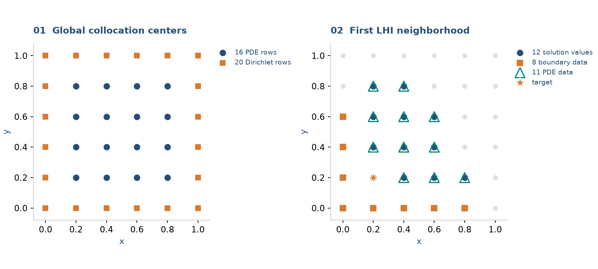

# Solve a PDE with local Hermite interpolation

**Goal:** construct Hermite trial functions, extract their named weight blocks,
and assemble the PDE yourself. Read [one stencil](one-stencil.md) first.

## 1. Separate unknown values and known data

For $Lu=f$ with Dirichlet boundary data $u=g$, use three point sets:
$X_u$ for unknown solution samples, $X_b$ for boundary samples, and $X_f$ for
PDE samples. Here $X_f=X_u$, but their functionals differ.

```python
import numpy as np
from scipy.sparse.linalg import spsolve
import rbflab as rbf
```

```python
--8<-- "examples/tutorials/lhi_construction.py:problem"
```

| Source block | Sampled functional | Values supplied after assembly |
|---|---|---|
| `u` | $s(X_u)$ | Unknown $U$ |
| `boundary` | $s(X_b)$ | Prescribed $g_b$ |
| `pde` | $Ls(X_f)$ | Prescribed $f_f$ |

A point may occur in both the value and PDE groups. Exclude a target from its
own PDE data: otherwise the requested $Ls(x_i)$ is already a supplied datum,
giving a tautology instead of a useful equation for $U$.



This illustration shows the original combined-neighbor selection: 12 solution,
8 boundary and 11 PDE samples at the first target. Below the counts are explicit
for every target, with independent nearest-neighbor selection in each group.
Tied distances can give different memberships from the illustration.

## 2. Translate the Hermite ansatz into code

Stack the selected functionals as $\ell=(I_u,I_b,L_f)$. Write

$$s_i(x)=\sum_j a_j\ell_j^y K(x,y_j)+\sum_m b_mp_m(x).$$

Then

$$H_i=\begin{bmatrix}G_i&P_i\\P_i^T&0\end{bmatrix},\qquad
(G_i)_{kj}=\ell_k^x\ell_j^yK,\qquad(P_i)_{km}=\ell_kp_m.$$

The target-functional weight equation is

$$H_i^T\begin{bmatrix}w_i\\\eta_i\end{bmatrix}
=\begin{bmatrix}(L_x\ell_j^yK)(x_i,y_j)\\(Lp_m)(x_i)\end{bmatrix}.$$

`space.representers(source)` encodes the source-side $\ell_j^y$. The requested
target operator supplies $L_x$. The same engine used in RBF-FD now builds
Hermite weights; no separate local solve implementation is needed.

```python
--8<-- "examples/tutorials/lhi_construction.py:solve"
```

The three sparse blocks express

$$Lu(X_u)\approx S_uU+S_bg_b+S_ff_f.$$

Therefore the stationary system is

$$\boxed{S_uU=f_u-S_bg_b-S_ff_f.}$$

There are 16 global solution unknowns. Each patch uses $12+8+11=31$ functionals
and six polynomial terms, giving a $37\times37$ local system.
The `Samples` objects do not store forcing or decide which values are unknown:
that interpretation belongs to the equation you assemble.

## 3. Inspect one local and one global equation

```python
--8<-- "examples/tutorials/lhi_construction.py:patch"
```

`patch.groups` contains indices into each group's own point array. Weights
follow the source dictionary's insertion order. Polynomial multipliers are
separate from the data weights and do not become global solution unknowns.
`reconstruct_local` returns the actual local matrix and target column on demand.

```python
--8<-- "examples/tutorials/lhi_construction.py:row"
```

Here `S` already indexes the interior unknown vector. No conversion from
whole-cloud indices is needed. The complete script checks this row against
`Su` and checks its right-hand side against `rhs`.

## 4. Evaluate between solution nodes

At query points, request identity and derivative maps from the same trial recipe:

```python
--8<-- "examples/tutorials/lhi_construction.py:evaluate"
```

The query construction relaxes `target="require"` for the solution samples:
an off-node target cannot be a member of the solution cloud. Each query selects
its own neighborhoods and applies its map to computed $U$ and prescribed $g,f$.
This differs from reusing the nearest assembled patch. Changing memberships
can still produce nonsmooth transitions; this is not a globally smooth interpolant.

## Modify the construction

- Change `operator=L` and the target operator together for another PDE.
- Supply a boundary functional and its measured/prescribed data for Neumann or
  Robin data; normal-dependent operators also need sample normals.
- Change each group's `size`, or specify exact memberships with `indices`.
- Choose `backend=rbf.CppBackend()` or `rbf.TorchBackend()` on the approximation
  for supported local assembly. Export blocks with `to_scipy()` if using a SciPy
  solve, as in [LHI and heat from matrices](lhi-matrices.md).
- For time dependence, PDE samples contain $f-u_t$; use the mass-matrix derivation
  in that lesson rather than inserting $f$ as stationary data.

## Complete example

Run `python -m examples.tutorials.lhi_construction` from a source checkout.

??? example "Complete runnable script"

    ```python
    --8<-- "examples/tutorials/lhi_construction.py"
    ```

[Download the script](https://raw.githubusercontent.com/LDBreton/RBFLAB/main/examples/tutorials/lhi_construction.py).

**Next:** [independent functional centers](lhi-centers.md), then
[LHI heat matrices](lhi-matrices.md).
