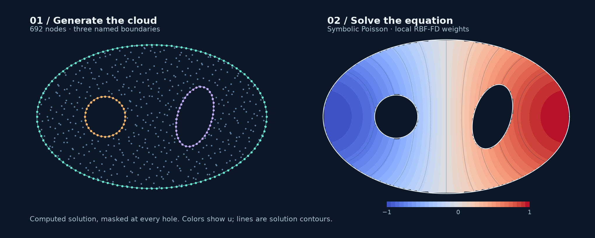

# Poisson on a domain with holes

Start with an ellipse, cut two named holes, and solve a scalar equation on the
remaining material. The same boundary names used to build the geometry become
labels in the symbolic problem. Requires RBFLAB 0.3 or newer.



## 1. Define the domain and sample nodes

```python
import numpy as np
import sympy as sp
import rbflab as rbf
from rbflab import geometry, meshgen

domain = geometry.with_holes(
    geometry.Ellipse(1.6, 1., labels=("wall",)),
    {"round_hole": geometry.Disk(.28, center=(-.65, 0)),
     "slot": geometry.Ellipse(.24, .43, center=(.6, 0), angle=-.3)},
)
cloud = meshgen.generate(domain, interior=500,
    boundary={"wall": 120, "round_hole": 32, "slot": 40}, seed=42)
```

This creates 692 nodes. Holes have no interior samples; their boundary nodes
are retained with normals pointing out of the material.

## 2. Write the equation

Use the manufactured solution $u_\star(x,y)=\sin(x)\cos(y)$, so that

$$
-\Delta u = 2\sin(x)\cos(y)\quad\text{in }\Omega,
\qquad u=u_\star\quad\text{on }\partial\Omega.
$$

The exterior and both holes are parts of $\partial\Omega$. Specifying an exact
solution gives us a way to measure discretization error independently of the
linear solver's residual.

```python
model = rbf.SymbolicScalar(2)
u = model.field
x, y = model.coordinates
exact = sp.sin(x)*sp.cos(y)
problem = model.stationary(
    sp.Eq(-model.laplacian(u), 2*exact),
    boundary=[model.bc(label, sp.Eq(u, exact)) for label in domain.boundaries],
)
```

## 3. Choose the local approximation

```python
method = rbf.RBFFD(
    rbf.PHS(5), 35, polynomial_degree=3,
    stencil_policy=rbf.StencilPolicy(scaling="local"),
    local_backend=rbf.PythonBackend(compute_condition=False),
)
solution = problem.solve(cloud, method)
```

Each Laplacian row comes from a 35-node local approximation augmented with all
2D polynomials of total degree at most three. The local coordinates are scaled
before constructing weights; physical derivative scaling is restored during
assembly. See [the weight derivation](../theory/local-weights.md).
`compute_condition=False` skips a diagnostic calculation, not a regularization
step. Use condition estimates when investigating a problematic cloud.

## 4. Measure error and plot

```python
reference = np.sin(cloud.points[:, 0])*np.cos(cloud.points[:, 1])
error = np.max(np.abs(solution.evaluate(cloud.points) - reference))
print("maximum nodal error:", error)
from rbflab import viz
fig, ax = viz.plot_scalar(solution, domain=domain, title="Poisson / two holes")
fig.savefig("solution.png", dpi=180)
```

The gallery's Float64 Python run measured maximum nodal error $3.77\times10^{-5}$
and independent off-node error $3.86\times10^{-5}$ at 120 query points. These are
one fixed recipe's measured errors, not a convergence claim. The full example
records precision and separate assembly/solve times; the rendering masks the
holes and exterior rather than drawing interpolated values across them.

## Run the complete example

From a source checkout:

```sh
python -m examples.poisson_perforated --plot solution.png
python -m examples.poisson_perforated --backend cpp
python -m examples.poisson_perforated --backend torch
python -m examples.poisson_perforated --interior 800 --seed 17
```

The shared example helper calls `method.prepare(problem, dimension=2)` for
compiled/tensor backends. C++ and PyTorch affect local Float64 weight assembly;
the global sparse solve remains on CPU. See [backend setup](../guides/curved-backends.md).

For refinement, increase boundary counts as well as interior nodes, test several
independent seeds, and keep the kernel/stencil policy fixed. The sampler does
not enforce a minimum node separation, so inspect the spacing and stencil-rank
diagnostics as well as solution error.
